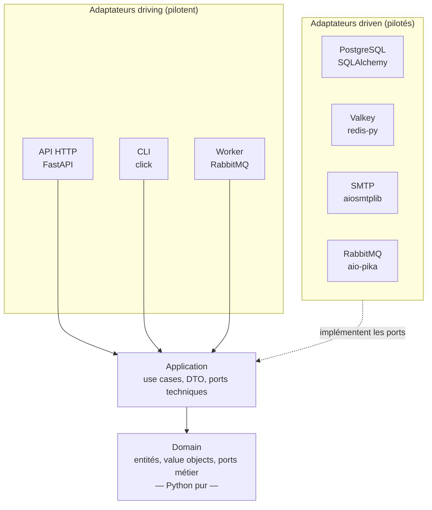

# 01. La règle de dépendance

> **TL;DR** — Une seule règle : les `import` pointent vers l'intérieur, vers le
> cœur métier. Tout le reste du cours en découle. Elle est vérifiable
> mécaniquement, en CI, par import-linter.

L'architecture hexagonale — publiée par Alistair Cockburn en 2005 sous le nom
**ports & adapters** — répond au problème du [chapitre 00](00-le-probleme.md)
avec une règle unique.

## La règle

> Les dépendances du code pointent **toujours vers l'intérieur**. Le cœur ne
> connaît aucune implémentation concrète du monde extérieur.

Attention à une confusion fréquente : « le cœur ne connaît rien de l'extérieur »
ne veut pas dire qu'il ignore tout besoin externe. Le domaine **déclare** ce dont
il a besoin (« je dois pouvoir sauvegarder une tâche ») sous forme d'interfaces —
les **ports** — sans jamais savoir qui les réalise. C'est de l'**inversion de
dépendance** : le besoin est possédé par celui qui l'exprime, pas par celui qui
le satisfait.

L'analogie de la prise électrique tient bien : ton appartement définit un
standard de prise (le port). Il ne sait pas si tu y brancheras une lampe ou un
aspirateur (les adaptateurs). Et surtout, ce n'est pas l'aspirateur qui dicte la
forme de la prise.



Les flèches pleines sont les `import`. Les flèches pointillées rappellent que
les adaptateurs driven **dépendent** des ports (ils les implémentent) : le sens
de la dépendance est inversé par rapport au sens de l'appel. À l'exécution,
l'application appelle la base de données ; à la compilation, c'est la base de
données qui dépend de l'interface définie plus au centre.

## Les quatre couches de ce projet

| Couche | Rôle | Dépend de |
|--------|------|-----------|
| `domain/` | Le cœur : entités, value objects, ports métier, exceptions | rien (Python pur) |
| `application/` | Use cases, DTO, ports techniques | `domain/` |
| `infrastructure/` | Adaptateurs driven : SQLAlchemy, Valkey, SMTP, RabbitMQ, config | `application/`, `domain/` |
| `presentation/` | Adaptateurs driving : API HTTP, CLI, worker | tout le reste |

> **Nuance utile** : « hexagonale » ne prescrit pas *quatre* couches. Cockburn
> décrit deux zones (dedans / dehors) et des ports. Le découpage en quatre
> couches vient plutôt de la *Clean Architecture* de Robert C. Martin, et il se
> marie bien avec l'hexagone. Ne confonds pas la règle (une) et le découpage
> (un choix).

## Driving vs driven : les deux côtés de l'hexagone

- Un adaptateur **driving** (pilotant) déclenche l'application. Ce projet en a
  **trois** : l'API HTTP, le CLI (`presentation/cli/`) et le worker RabbitMQ
  (`presentation/worker/`).
- Un adaptateur **driven** (piloté) est appelé par l'application : PostgreSQL,
  Valkey, SMTP, le broker.

Le point clé : un use case ne connaît ni l'adaptateur qui l'appelle, ni celui qui
le sert. C'est exactement pour ça que `CreateUser` est réutilisé tel quel par
l'API **et** par le CLI de ce projet, sans une ligne d'adaptation.

Un même outil peut d'ailleurs apparaître des deux côtés : RabbitMQ est **driven**
quand `ShareTask` y publie un message, et **driving** quand le worker consomme ce
message pour déclencher `NotifyTaskShared`.

## Comment on la vérifie ici

Une règle d'architecture qui n'est pas vérifiée automatiquement se dégrade en
quelques mois. La vérification naïve est un `grep` :

```bash
grep -rE "fastapi|sqlalchemy|pydantic" src/task_manager/domain/   # → doit être vide
```

C'est un bon réflexe de contrôle rapide, mais ce n'est **pas** la source de
vérité de ce projet : un `grep` ne voit pas les imports **transitifs** (un module
du domaine qui importe un module « pur » qui, lui, importe SQLAlchemy) et produit
des faux positifs sur des commentaires.

La vraie garantie est **import-linter**, configuré dans `pyproject.toml`
(`[tool.importlinter]`), qui analyse le graphe d'imports réel :

```bash
make imports          # ou : uv run lint-imports
```

Deux contrats sont déclarés :

1. **`layers`** — l'empilement `presentation → infrastructure → application →
   domain`. Interdit par exemple qu'`application/` importe `infrastructure/`.
2. **`forbidden`** — aucun de `fastapi`, `sqlalchemy`, `pydantic`,
   `pydantic_settings`, `starlette` ne doit être atteignable depuis
   `task_manager.domain`, même indirectement.

En cas de violation, l'outil affiche la chaîne d'imports fautive avec le numéro
de ligne. Il tourne dans `make lint`, en pre-commit et en CI. **C'est là que la
règle de dépendance cesse d'être une intention.**

| Concept | Ce que dit le principe | Ce que fait ce projet |
|---------|------------------------|-----------------------|
| Vérification de l'archi | La règle doit être testable, pas seulement documentée | import-linter (2 contrats) en pre-commit + CI |
| Nombre de couches | Non prescrit (dedans / dehors) | 4 couches, héritées de la Clean Architecture |

## Ce que ça t'apporte concrètement

- **Testabilité** — le domaine se teste sans base ni HTTP, en millisecondes
  (72 tests unitaires de domaine dans ce projet, quasi instantanés).
- **Remplaçabilité** — ce template est passé de SQLite à PostgreSQL : seuls la
  config, le moteur SQLAlchemy et les tests ont changé. Zéro ligne de `domain/`
  ni d'`application/`.
- **Réutilisation des cas d'usage** — `CreateUser` sert l'API et le CLI.
- **Lisibilité** — les règles métier se lisent sans la technique autour.

## À retenir

- Une seule règle : les dépendances pointent vers l'intérieur.
- Le cœur ne connaît pas les implémentations, mais il **déclare ses besoins**
  via des ports (inversion de dépendance).
- « Port » = interface, « adaptateur » = implémentation. Driving = pilote,
  driven = piloté. Un même outil peut être les deux.
- Une règle d'architecture non automatisée se dégrade : ici, import-linter.

## À toi de jouer

1. `domain/user/value_objects.py` importe `email_validator`, une bibliothèque
   tierce. Est-ce une violation de la règle de dépendance ? Justifie — et
   regarde le contrat `forbidden` de `pyproject.toml` pour vérifier.
2. Un collègue place `TaskRepository` (l'interface) dans `infrastructure/` et
   fait importer ce module par `application/`. Quel contrat import-linter casse,
   et quelle capacité concrète perd-on ?

→ [Corrigés](14-annexes.md#c-corrigés-des-exercices)
