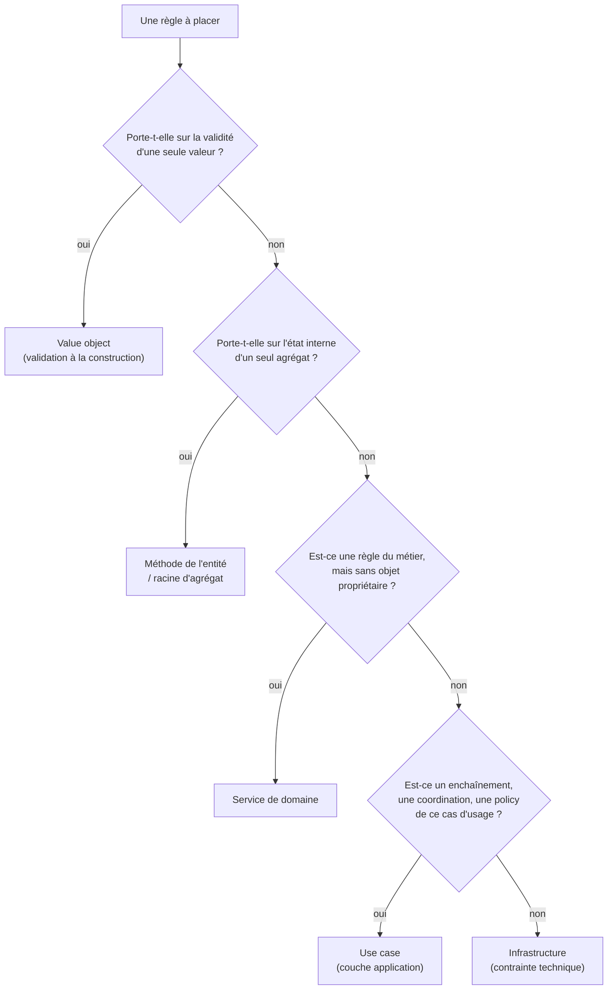

# 02. Où vit une règle ?

> **TL;DR** — « Le domaine contient les règles, l'application orchestre » est
> trop grossier pour décider en pratique. Ce chapitre donne l'arbre de décision
> qui manque : invariant d'objet → value object / entité ; invariant d'agrégat →
> racine ; règle métier sans propriétaire naturel → service de domaine ;
> enchaînement → use case ; contrainte technique → infrastructure.

C'est le chapitre le plus utile du cours. Tout le reste est de la machinerie ;
ici, c'est la compétence de conception elle-même.

## Le vrai problème : « règle métier » ne veut rien dire

On dit facilement « les règles métier vont dans le domaine ». Mais mets côte à
côte ces cinq affirmations, toutes vraies dans ce projet :

1. Un titre de tâche ne peut pas être vide.
2. Une tâche déjà terminée ne peut pas être terminée une seconde fois.
3. On ne crée pas une tâche pour un utilisateur qui n'existe pas.
4. Une adresse e-mail doit être unique parmi les utilisateurs.
5. `tasks.owner_id` doit référencer une ligne existante de `users`.

Elles ressemblent toutes à « du métier ». Elles vivent pourtant à quatre endroits
différents, et pour des raisons précises.

## L'arbre de décision



Reprenons nos cinq règles.

### 1. « Un titre ne peut pas être vide » → value object

La règle porte sur **une valeur isolée**. Elle ne dépend d'aucun contexte, aucun
autre objet, aucune requête. Elle appartient au type lui-même.

```python
# domain/task/value_objects.py
@dataclass(frozen=True, slots=True)
class TaskTitle:
    value: str

    def __post_init__(self) -> None:
        cleaned = self.value.strip()
        if not cleaned:
            raise EmptyTitle()
```

Conséquence : **tout** appelant est couvert. L'API, le CLI, le worker, un test,
un futur import CSV. La règle n'a plus besoin d'être répétée nulle part.

### 2. « Pas de double complétion » → méthode de l'entité

La règle porte sur une **transition d'état** d'un seul objet, en fonction de son
état courant. Seule l'entité connaît cet état, donc seule elle peut la garantir.

```python
# domain/task/entities.py
def complete(self) -> None:
    if self.status is TaskStatus.DONE:
        raise TaskAlreadyCompleted()
    self.status = TaskStatus.DONE
    self.completed_at = _now()
```

C'est ce qu'on appelle un **invariant** : une propriété qui doit rester vraie à
tout moment de la vie de l'objet.

Bel exemple inverse dans le même fichier : `rename()` **autorise** le renommage
d'une tâche terminée, et le docstring l'explique. Ce n'est pas un oubli, c'est
une décision métier — corriger un libellé fautif reste légitime après coup. Une
règle absente doit être aussi explicite qu'une règle présente.

### 3. « Le propriétaire doit exister » → use case

Ici on quitte le domaine. Cette vérification implique **deux agrégats**
(`Task` et `User`), et aucun des deux ne peut la porter : `Task` ne connaît pas
le référentiel des utilisateurs, et `User` n'a pas à connaître les tâches. Il
faut aussi **interroger un port**, donc faire une I/O — ce que les entités ne
font jamais.

```python
# application/task/use_cases/create_task.py
owner_id = UserId.from_string(command.owner_id)
if not await self._users.exists(owner_id):
    raise UserNotFound(str(owner_id))
task = Task.create(owner_id=owner_id, title=TaskTitle(command.title))
```

Le use case **coordonne**, il ne décide pas de ce qu'est une tâche valide.

### 4. « E-mail unique » → règle partagée entre application et infrastructure

Celle-ci est instructive parce qu'elle n'a pas de réponse unique. L'unicité est
une propriété d'un **ensemble** d'utilisateurs, pas d'un utilisateur : aucune
entité ne peut la garantir seule.

En pratique, elle se joue à deux niveaux :

- le use case interroge le port (`find_by_email`) et lève `EmailAlreadyUsed`
  (`ConflictError` → 409) — c'est ce qui produit une **erreur métier lisible** ;
- la base porte une contrainte `UNIQUE` — c'est ce qui **garantit** réellement
  l'intégrité, y compris en cas de course entre deux requêtes concurrentes.

Retiens la formulation : le use case donne le **message**, la base donne la
**garantie**. Vérifier en amont sans contrainte en base, c'est un bug de
concurrence en attente.

### 5. « FK vers users » → infrastructure

Purement technique. La `ForeignKey("users.id", ondelete="CASCADE")` traduit dans
PostgreSQL une relation que le domaine exprime déjà par un `UserId`. Le domaine
ignore jusqu'à l'existence du mot « clé étrangère ».

## Et le service de domaine ?

C'est le cas de figure que ce projet n'a pas, et qu'il faut pourtant connaître.

Un **service de domaine** héberge une règle qui est *incontestablement* métier,
mais qui n'appartient naturellement à **aucune** entité. Le signal classique : la
règle a besoin de plusieurs objets à parts égales, et la placer dans l'un d'eux
serait arbitraire.

```python
# domain/pricing/services.py  (exemple illustratif, hors de ce projet)
class PricingService:
    """Le prix dépend du client ET de la commande. Ni l'un ni l'autre n'en est
    le propriétaire naturel : la règle vit dans un service du domaine."""

    def calculate(self, customer: Customer, order: Order) -> Money:
        base = order.subtotal()
        if customer.is_premium and base > Money(100, "EUR"):
            return base * Decimal("0.9")
        return base
```

Trois garde-fous :

- Il est **sans état**. Dans cette architecture, il ne fait **pas d'I/O** non
  plus : un besoin de lecture externe est orchestré par la couche application,
  qui passe la donnée déjà chargée au service. Ce n'est pas une loi du DDD — on
  trouve des services de domaine qui dépendent d'une abstraction du domaine pour
  obtenir une information nécessaire à leur décision. Le critère qui tient
  toujours est ailleurs : un service de domaine porte une **décision métier**, il
  ne pilote pas le **workflow applicatif**.
- Il porte un nom du **langage métier** (`PricingService`, `TransferPolicy`),
  jamais `TaskManager` ou `UserHelper`.
- **N'en abuse pas.** Le réflexe de tout mettre en service produit exactement le
  modèle anémique qu'on cherche à fuir. Demande-toi toujours d'abord si une
  entité pourrait légitimement porter la règle.

## Et les « policies » applicatives ?

Nuance importante, souvent absente des cours : la couche application n'est pas
*totalement* vide de décisions. Elle peut porter des règles qui appartiennent au
**cas d'usage** plutôt qu'au métier intemporel :

```python
if command.amount > DAILY_TRANSFER_LIMIT:
    raise DailyTransferLimitExceeded()
```

Un plafond journalier configurable, une limite de pagination, un quota par
appelant : ce sont des règles de la *façon dont on expose* le métier, pas des
invariants d'un objet. Les forcer dans le domaine le pollue ; les nier fait
mentir le cours.

La formulation honnête est donc :

> Le use case ne contient pas les **invariants** du domaine. Il peut contenir la
> **policy du cas d'usage**.

C'est plus long que « l'application ne contient aucune règle », mais c'est
utilisable pour décider.

## Le tableau de synthèse

| Type de décision | Domicile | Exemple dans ce projet |
|------------------|----------|------------------------|
| Validité d'une valeur | Value object | `TaskTitle`, `Email`, `UserName` |
| Invariant d'un objet | Méthode d'entité | `Task.complete()` |
| Invariant d'un agrégat | Racine d'agrégat | (voir [ch. 04](04-les-agregats.md)) |
| Règle métier sans propriétaire | Service de domaine | — (exemple `PricingService`) |
| Coordination inter-agrégats | Use case | `CreateTask` vérifie l'owner |
| Policy du cas d'usage | Use case | pagination bornée, TTL de cache |
| Optimisation de lecture | Use case + port technique | cache-aside de `GetUser` |
| Intégrité, unicité, transport | Infrastructure | FK, `UNIQUE`, index |

## Le test décisif : « qui d'autre pourrait l'appeler ? »

Quand tu hésites, pose cette question :

> Si demain cette opération est déclenchée par un import CSV, un cron ou un
> message de broker — la règle doit-elle encore s'appliquer ?

- **Oui, absolument** → domaine. Elle est constitutive de l'objet.
- **Oui, mais différemment selon le point d'entrée** → application (policy).
- **Non, c'est propre à ce canal** → adaptateur (schéma HTTP, argument CLI).

Ce projet rend le test très concret, parce que trois adaptateurs entrants
existent réellement : ce qui doit valoir pour l'API, le CLI et le worker à la
fois n'a rien à faire dans le router.

## À retenir

- « Règle métier » recouvre au moins quatre choses différentes : invariant de
  valeur, invariant d'objet, règle sans propriétaire, policy applicative.
- Le domaine porte ce qui est **vrai de l'objet** ; l'application porte ce qui
  est **vrai de ce cas d'usage** ; l'infrastructure porte ce qui est **vrai de
  la technique**.
- Un service de domaine porte une **décision métier** sans piloter le workflow ;
  ici, il est sans état et sans I/O.
- Une garantie d'unicité se joue à deux niveaux : message côté use case,
  garantie côté base.
- Test décisif : « si un autre appelant déclenchait ça, la règle tiendrait-elle
  encore ? »

## À toi de jouer

1. Nouvelle règle : *« un utilisateur ne peut pas avoir plus de 50 tâches en
   cours »*. Réponds aux quatre questions, dans cet ordre :
   **a.** où places-tu la règle ? **b.** pourquoi pas dans `User` ?
   **c.** que se passe-t-il si deux requêtes créent une tâche au même instant
   alors qu'il en reste une de disponible ? **d.** quelle contrainte ou quel
   mécanisme ajouterais-tu côté base pour que la limite tienne vraiment ?
2. Nouvelle règle : *« le titre d'une tâche ne peut pas dépasser 200
   caractères »*. Elle est déjà exprimée à deux endroits dans ce projet.
   Lesquels, et est-ce une duplication fautive ?
3. Nouvelle règle : *« la liste des tâches renvoyée par l'API est plafonnée à
   100 éléments »*. Domaine, application ou présentation ?

→ [Corrigés](14-annexes.md#c-corrigés-des-exercices)
