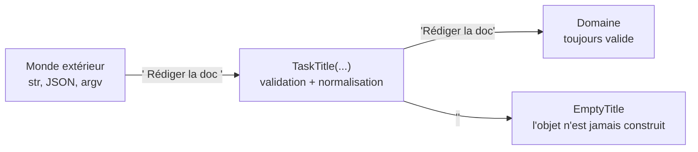

# 03. Le domaine (DDD tactique)

> **TL;DR** — Le DDD tactique fournit trois briques : value objects (définis par
> leur valeur), entités (définies par leur identité), agrégats (frontières de
> cohérence, [chapitre 04](04-les-agregats.md)). Le domaine ne fait **aucune
> I/O** et n'importe **aucun framework**.

Le domaine est le cœur : les règles, exprimées avec les mots du métier. Avant les
patterns, une précision de vocabulaire s'impose.

## DDD stratégique vs DDD tactique

Le DDD n'est pas une liste de classes. Il a deux moitiés, et ce cours n'en
traite vraiment qu'une :

```text
DDD
├── Stratégique  (le plus important, le moins codé)
│   ├── langage ubiquitaire   — parler comme le métier, dans le code
│   ├── bounded contexts      — frontières de sens
│   └── context mapping       — comment les contextes s'intègrent
│
└── Tactique     (les briques de code)
    ├── value objects
    ├── entités
    ├── agrégats
    ├── services de domaine
    ├── repositories (ports)
    └── domain events
```

Une conséquence pratique du **langage ubiquitaire** : les noms du code viennent
des experts métier, pas de la base de données. `TaskTitle`, `EmptyTitle`,
`TaskAlreadyCompleted` sont des phrases du métier. Si tu te surprends à nommer
une classe `TaskRow`, `UserData` ou `TaskManagerHelper`, tu as basculé du côté
technique.

## DDD stratégique en 15 minutes

Le reste de ce chapitre — et une bonne partie du cours — traite du tactique.
C'est un déséquilibre assumé : ce dépôt est un exemple de code, et le stratégique
se joue en réunion avec des experts métier, pas dans un fichier Python.

Mais il faut savoir ceci : **on peut appliquer parfaitement tous les patterns
tactiques et rater complètement le DDD.** Des entités impeccables sur des
frontières mal découpées produisent un système propre localement et incohérent
globalement. Voici donc le minimum pour ne pas réduire le DDD à « entités +
value objects + agrégats ».

### Bounded context : une frontière de sens

Un **bounded context** est une frontière à l'intérieur de laquelle un **modèle
et son langage sont cohérents**, et dont les règles de signification sont
maîtrisées. Ce n'est pas d'abord une affaire de vocabulaire : c'est une affaire
de modèle.

Le vocabulaire en est le **meilleur indice**, et le plus facile à observer : si
le même terme recouvre des concepts ou des règles différentes selon les
interlocuteurs, c'est un signal fort qu'il faut examiner une séparation. Ce n'est
pas à lui seul un critère suffisant — deux équipes peuvent parfaitement partager
un mot et sa définition tout en ayant besoin de modèles séparés, pour des raisons
de cycle de vie, de rythme de changement ou de propriété.

Exemple classique : dans un e-commerce, `Product` désigne dans `catalog` un
descriptif avec photos, catégories et prix affiché — et dans `ordering` une
référence, un prix figé au moment de la commande et une quantité. Même mot, deux
concepts. La bonne réponse **n'est pas** de fabriquer un `Product` universel qui
satisfait les deux : c'est de reconnaître qu'il y en a deux.

C'est contre-intuitif quand on a appris à factoriser. Retiens : **le
dédoublement d'un concept entre deux contextes n'est pas de la duplication à
éliminer.** Un modèle unique qui sert tout le monde ne sert bien personne — le
symptôme est une classe qui grossit avec des champs optionnels qui n'ont de sens
que pour la moitié des appelants.

### Context map : comment les contextes se parlent

Une **context map** décrit les relations entre contextes. Les quelques formes à
connaître :

| Relation | Ce que ça veut dire | Quand |
|---|---|---|
| **Shared kernel** | Deux contextes partagent un petit noyau de modèle, modifié d'un commun accord | Équipes proches, noyau vraiment stable |
| **Customer / supplier** | L'amont s'engage à servir les besoins de l'aval ; négociation possible | Deux équipes, une dépendance assumée |
| **Conformist** | L'aval adopte tel quel le modèle de l'amont, sans négocier | L'amont ne bougera pas (SI historique, API tierce) |
| **Anti-corruption layer** | L'aval traduit le modèle de l'amont dans le sien, via une couche dédiée | Le modèle amont est inadapté ou instable |

L'**anti-corruption layer** (ACL) est de loin la plus utile à connaître, et c'est
exactement la même idée que ce cours applique partout : une couche de traduction
qui empêche un modèle extérieur de contaminer le tien. Un mapper protège ton
domaine de l'ORM ; un ACL protège ton contexte du modèle d'un autre système.

### Et dans ce projet ?

La réponse honnête mérite mieux qu'un « oui ». `task` et `user` sont souvent
présentés comme deux bounded contexts. Regarde les indices, sans en faire un seul
test : `User` n'a qu'un sens ici — le propriétaire d'une tâche, partout, sans
ambiguïté. Une seule équipe, un seul déploiement, une seule migration qui crée
les deux tables, et un `CreateTask` qui exige une cohérence immédiate entre les
deux. Aucun indice ne va dans le sens de deux modèles distincts.

Ce sont donc **deux agrégats dans un seul bounded context**, tranchés
verticalement en modules. Ce n'est pas un défaut : le découpage est juste, il
rend une extraction future presque gratuite, et le métier est trop simple pour
justifier deux vocabulaires. Mais l'étiquette est plus ambitieuse que la réalité,
et le savoir fait partie du sujet — c'est développé dans le
[carnet de terrain](../ddd-strategique-terrain.md).

Ce qui est bien réel : la relation entre les deux tranches est minimale. `task`
connaît `UserId` et rien d'autre — pas de `User` importé, pas de nom, pas
d'e-mail. Et `domain/shared/` (bases d'exceptions) est ce qui s'approche le plus
d'un **shared kernel** : quelques classes sans logique, stables par nature. C'est
la seule forme de noyau partagé qui vieillit bien ; le jour où on y mettrait des
règles, il faudrait le découper.

Il n'y a pas d'ACL non plus. Le jour où `user` deviendrait un service distinct,
c'est précisément là qu'il faudrait en introduire un — et le fait que `task` ne
connaisse qu'un `UserId` rend ce jour-là beaucoup moins douloureux.

> **Ce qu'il faut retenir** : le stratégique décide **où sont les frontières** ;
> le tactique décide **comment on code à l'intérieur d'une frontière**. Se
> tromper de frontière coûte infiniment plus cher que se tromper de pattern.

> 📋 **Pour la pratique** : cette section donne le vocabulaire, pas la méthode.
> La procédure d'atelier (EventStorming, repérage des ruptures, context map,
> tests de validation d'une frontière) vit dans un carnet séparé —
> [DDD stratégique, carnet de terrain](../ddd-strategique-terrain.md) — parce
> qu'elle se *fait* avec des experts métier et ne se lit pas dans un dépôt de
> code.

## DDD tactique en 15 minutes

Symétrique de la section précédente. Voici la boîte à outils complète, avant
d'entrer dans le détail : ce chapitre traite les trois premières briques, les
agrégats ont le [chapitre 04](04-les-agregats.md), les repositories le
[chapitre 06](06-application-et-ports.md), les événements le
[chapitre 11](11-cache-et-evenements.md).

| Brique | À quelle question elle répond | Dans ce projet |
|---|---|---|
| **Value object** | « Cette chose est-elle définie par sa valeur ? » | `TaskTitle`, `Email`, `UserName`, `TaskStatus`, `TaskId`, `UserId` |
| **Entité** | « A-t-elle une identité qui survit à ses changements ? » | `Task`, `User` |
| **Agrégat** + racine | « Qu'est-ce qui doit être cohérent dans la même transaction ? » | `Task` et `User`, chacune racine de son agrégat |
| **Factory** | « Comment naît un objet déjà valide ? » | `Task.create()`, `User.create()` |
| **Repository** (port) | « Comment retrouver et persister un agrégat ? » | `TaskRepository`, `UserRepository`, déclarés dans `domain/` |
| **Service de domaine** | « Où va une règle métier qui n'appartient à aucun objet ? » | **absent** — aucune règle n'est dans ce cas ici |
| **Domain event** | « Que faire savoir quand quelque chose d'important s'est produit ? » | **absent** — le métier est trop simple ; le message RabbitMQ est un événement d'*intégration*, ce qui est autre chose ([ch. 11](11-cache-et-evenements.md)) |

Deux remarques sur la colonne de droite.

**Les absences sont documentées.** Ce projet n'a ni service de domaine ni
événement de domaine, et c'est écrit noir sur blanc. Un dépôt qui exhibe les sept
briques parce qu'elles figurent dans le livre enseigne à cocher des cases ; un
dépôt qui dit « je n'en ai pas besoin ici, et voilà pourquoi » enseigne à décider.

**Ce ne sont pas des cases à cocher.** Chaque brique répond à une question de la
colonne du milieu. Si la question ne se pose pas, la brique est du décor — et du
décor coûteux, parce qu'il faut le maintenir. Le
[chapitre 02](02-ou-vit-une-regle.md) est précisément l'outil qui te dit laquelle
sortir.

> Ces briques ne se choisissent pas dans l'ordre du tableau. On part toujours du
> même endroit : où est la frontière de cohérence ([ch. 04](04-les-agregats.md)),
> puis quelle décision vit où ([ch. 02](02-ou-vit-une-regle.md)). Le tableau est
> un inventaire, pas une méthode.

## Value objects : définis par leur valeur

**La propriété qui définit un value object est l'absence d'identité propre :
deux value objects de même valeur sont interchangeables.** Deux `Email("a@b.c")`
sont *le même* e-mail ; on ne se demande jamais « lequel des deux ? ».

L'immuabilité et l'auto-validation ne *définissent* pas le concept — ce sont des
pratiques (excellentes) qui en découlent presque toujours.

| Concept | Ce que dit le principe | Ce que fait ce projet |
|---------|------------------------|-----------------------|
| Value object | Pas d'identité, égalité par valeur | `dataclass(frozen=True, slots=True)` : immuable, auto-validé, normalisé |

```python
# domain/task/value_objects.py
@dataclass(frozen=True, slots=True)   # frozen → immuable ; slots → pas de __dict__
class TaskTitle:
    value: str

    def __post_init__(self) -> None:
        cleaned = self.value.strip()
        if not cleaned:
            raise EmptyTitle()                     # invalide → l'objet n'existe pas
        if len(cleaned) > TITLE_MAX_LENGTH:
            raise TitleTooLong(TITLE_MAX_LENGTH)
        object.__setattr__(self, "value", cleaned) # normalisation, voir ci-dessous
```

### Pourquoi `object.__setattr__` ?

`frozen=True` fait lever une erreur à toute affectation `self.value = ...`, y
compris dans `__post_init__`. Pour **normaliser** la valeur (ici, retirer les
espaces de bord) au moment de la construction, on contourne explicitement le
garde-fou via `object.__setattr__`.

C'est une exception assumée et localisée : elle n'a lieu qu'à la construction,
avant que l'objet ne soit visible de qui que ce soit. Une fois `__init__`
terminé, l'objet est bel et bien immuable pour tout le reste du programme.

### Le gain : *always-valid model*



Une fois cette barrière franchie, **plus une seule ligne du domaine n'a besoin de
re-vérifier**. La question « et si le titre était vide ? » ne se pose plus : un
`TaskTitle` vide n'existe pas. La validation est faite une fois, au bon endroit.

Compare :

```python
Email("bob@example.com")     # ✅ construit → forcément valide
user.email = "n'importe quoi" # ❌ impossible : Email refuse la construction
```

### Un value object ne fait pas d'I/O

`Email` illustre magnifiquement une frontière qu'on franchit sans y penser :

```python
# domain/user/value_objects.py
validate_email(cleaned, check_deliverability=False)
```

Activer `check_deliverability` (le défaut de la bibliothèque) résoudrait les
enregistrements MX du domaine — donc **une I/O réseau au cœur du domaine**. La
validité d'un e-mail dépendrait alors du DNS : non déterministe, lente, et
capable de rejeter une adresse parfaitement valide sur une panne de résolution.

La règle générale : **un value object valide une forme, jamais un fait du monde
extérieur.** Vérifier qu'une adresse *reçoit* réellement du courrier est le
travail d'un adaptateur (envoi d'un e-mail de confirmation), pas d'un VO.

Autres value objects du projet : `UserName`, `TaskStatus` (énumération d'états),
et les identités `TaskId` / `UserId`.

### Les identités sont des value objects

`UserId` encapsule un `uuid.UUID`. Deux détails de conception :

```python
@classmethod
def generate(cls) -> UserId:
    return cls(uuid.uuid7())      # UUIDv7, pas uuid4

@classmethod
def from_string(cls, raw: str) -> UserId:
    try:
        return cls(uuid.UUID(raw))
    except ValueError as exc:
        raise InvalidUserId(raw) from exc   # erreur métier, pas ValueError brute
```

- **UUIDv7** (stdlib depuis Python 3.14) est ordonné temporellement, ce qui
  améliore généralement la localité des insertions dans un index B-tree par
  rapport à `uuid4()`. Ce n'est pas une garantie absolue et ça ne remplace pas
  une stratégie d'indexation adaptée aux requêtes réelles. Le point qui compte
  ici est ailleurs : **l'identité est générée par le domaine**, sans round-trip
  vers la base.
  > ⚠️ Un UUIDv7 n'est pas séquentiel comme un auto-increment, mais il **révèle
  > l'instant de création**. Ce n'est pas un mécanisme de sécurité : si la
  > confidentialité des identifiants compte, c'est une décision à prendre
  > séparément.
- `from_string` traduit une erreur technique (`ValueError`) en **erreur métier**
  (`InvalidUserId`), qui deviendra un 422 à la frontière HTTP. Le domaine ne
  laisse pas fuiter les exceptions de la stdlib vers le haut.

## Entités : définies par leur identité

Une entité a une **identité stable dans le temps**. Une `Task` reste « la même
tâche » quand son titre change. Deux entités sont égales si elles ont le même
identifiant — pas la même valeur.

```python
def __eq__(self, other: object) -> bool:
    return isinstance(other, Task) and other.id == self.id

def __hash__(self) -> int:
    return hash(self.id)
```

Note le `__hash__` : Python le met à `None` dès qu'on définit `__eq__`. Sans lui,
une `Task` ne pourrait plus entrer dans un `set` ni servir de clé de `dict`.

## Les invariants vivent dans l'entité

Un **invariant** est une règle qui doit rester vraie à tout instant. Le point
crucial : l'entité protège **ses propres** invariants via ses méthodes. On ne
modifie pas son état de l'extérieur en assignant ses attributs.

```python
task.status = TaskStatus.DONE   # ❌ contourne la règle, completed_at reste None
task.complete()                 # ✅ la règle et la cohérence sont garanties
```

C'est le **modèle riche** (l'objet a du comportement), par opposition au **modèle
anémique** (un sac de données que du code extérieur manipule).

| | Modèle anémique | Modèle riche |
|---|---|---|
| L'objet contient | des attributs | des attributs **et** des comportements |
| La règle vit | dans les services / routers | dans l'objet |
| Un nouvel appelant | doit reconnaître la règle | l'obtient gratuitement |
| Symptôme | des setters partout | des verbes métier (`complete`, `rename`) |

> **Nuance Python.** Ce projet laisse les attributs de `Task` publics : rien
> n'empêche techniquement `task.status = ...`. Un modèle plus strict les
> préfixerait `_status` et exposerait des `@property` en lecture seule. C'est un
> curseur : plus de protection contre plus de cérémonie. Ce qui compte est que le
> chemin **prévu** passe par les méthodes, et que la revue de code sanctionne
> l'autre. Retiens le principe, pas la syntaxe.
>
> **Ce que l'outillage peut faire.** La revue de code n'est pas le seul recours.
> Le jour où l'on passe aux propriétés, deux garde-fous *existants* ferment les
> deux contournements sans une ligne d'outillage sur mesure : mypy strict refuse
> `task.status = X` (*« Property "status" is read-only »*), et la règle Ruff
> `SLF001` refuse la porte de service `task._status = X`. Cette dernière est déjà
> activée dans ce dépôt — elle attend le refactoring. En revanche, **aucun linter
> ne peut rien tant que les attributs sont publics** : sans inférence de types, il
> ne sait pas que `task` est une `Task`. C'est ce qui fait de l'encapsulation un
> choix de conception, pas un réglage d'outil.

## Les factories : construire un objet valide

`Task.create()` est une **factory** : elle produit un objet dans un état initial
cohérent (statut `TODO`, `created_at` renseigné, `completed_at` à `None`, identité
générée). Le constructeur brut, lui, sert à **reconstituer** une tâche existante —
c'est ce qu'utilise le mapper de persistance ([ch. 07](07-adaptateurs.md)).

Deux intentions différentes, deux points d'entrée : « créer quelque chose de
neuf » ≠ « rematérialiser quelque chose qui existe déjà ».

## Les exceptions métier

Les erreurs du domaine sont des **exceptions métier**, pas des codes HTTP. Le
domaine ignore HTTP ; il lève `TaskNotFound`, `EmailAlreadyUsed`, et c'est la
présentation qui traduira ([ch. 08](08-transactions-et-erreurs.md)).

```python
# domain/shared/exceptions.py
class DomainError(Exception): ...
class ValidationError(DomainError): ...   # invariant de VO non respecté
class NotFoundError(DomainError): ...     # ressource introuvable
class ConflictError(DomainError): ...     # conflit d'unicité ou d'état
```

**Attention à ne pas tout ranger sous `DomainError`.** Une base injoignable, un
timeout SMTP, un broker indisponible ne sont pas des erreurs métier. Ce projet
leur donne une hiérarchie parallèle, `InfrastructureError`
(`application/shared/errors.py`), traduite en 503 et non en 4xx. La distinction
est développée au [chapitre 08](08-transactions-et-erreurs.md#3-deux-familles-derreurs).

## Pourquoi pas Pydantic dans le domaine ?

Question légitime : ce serait plus concis. L'argument tient en une phrase :

> Le domaine ne devrait pas dépendre d'une bibliothèque de
> validation/sérialisation dont il n'a pas besoin.

Pydantic est excellent — ce projet s'en sert massivement pour les schémas HTTP et
la configuration, et le [chapitre 07](07-adaptateurs.md) montre pourquoi c'est le
bon outil **à la frontière**. Simplement, dans le cœur, il apporte des
fonctionnalités (parsing, coercition, sérialisation JSON) que le domaine n'utilise
pas, au prix d'une dépendance externe à l'endroit qui devrait être le plus stable
du projet. Les `dataclass` de la stdlib offrent l'essentiel du confort pour zéro
dépendance.

Ce n'est pas une loi : certaines équipes acceptent Pydantic dans le domaine en
assumant d'en suivre le cycle de vie. Le point non négociable est de savoir
**pourquoi** on l'y met, plutôt que de l'y trouver par défaut.

## À retenir

- **Value object** : la propriété définissante est l'**égalité par valeur**.
  Immuabilité et auto-validation sont des pratiques, excellentes, qui en découlent.
- Un VO valide une **forme**, jamais un fait du monde extérieur : **aucune I/O**
  dans le domaine.
- **Entité** : identité stable, égalité par id (et n'oublie pas `__hash__`).
- Les **invariants** vivent dans l'entité : on change l'état par des verbes
  métier, pas par des affectations.
- Modèle **riche** > modèle **anémique**.
- Le domaine lève des **exceptions métier** ; les erreurs techniques ont leur
  propre hiérarchie.

## À toi de jouer

1. Écris un value object `Money` (montant + devise) : refuse un montant négatif,
   refuse l'addition de deux devises différentes. Quelle méthode dois-tu ajouter
   pour que `Money(10, "EUR") == Money(10, "EUR")` soit vrai — et pourquoi
   `dataclass` te la donne-t-elle gratuitement, contrairement à `Task` ?
2. Un collègue ajoute à `Email` une vérification que le domaine possède bien un
   enregistrement MX. Cite deux conséquences concrètes sur les tests unitaires du
   domaine.
3. `Task.rename()` accepte de renommer une tâche `DONE`. Où irait la garde si le
   métier décidait de l'interdire — et où **surtout pas** ?

→ [Corrigés](14-annexes.md#c-corrigés-des-exercices)
