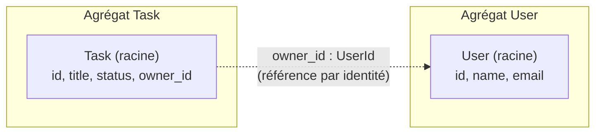

# 04. Les agrégats

> **TL;DR** — Un agrégat n'est pas « un objet et ses enfants ». C'est une
> **frontière de cohérence transactionnelle** : l'ensemble de ce qui doit rester
> cohérent au sein d'une même transaction. Tout le reste — racine, références,
> cardinalités — découle de cette définition.

C'est le concept le plus mal enseigné du DDD, généralement réduit à une question
de relations SQL. Prenons-le par le bon bout.

## La définition qui compte

> Un **agrégat** est un groupe d'objets traité comme une **unité de cohérence
> métier**. Il a une **racine** (*aggregate root*), seul point d'entrée des
> modifications, qui garantit que l'ensemble reste valide. Ses invariants sont
> vérifiés **dans une même transaction**.

> ⚠️ **Ce que cette définition ne dit pas.** « Unité de cohérence » ne veut pas
> dire « on fait toujours un `SELECT` de tous les champs, on hydrate tout, on
> réécrit tout ». L'agrégat définit la **frontière métier** et le **point
> d'entrée des modifications** ; la stratégie de persistance reste un choix
> séparé, qui peut charger partiellement, écrire de façon incrémentale, ou
> s'appuyer sur un verrou optimiste. Confondre les deux pousse mécaniquement vers
> de gros agrégats très coûteux — exactement ce qu'on cherche à éviter.

La question de conception n'est donc jamais « ces objets sont-ils liés ? »
(presque tout est lié à presque tout) mais :

> **Ces objets doivent-ils être cohérents dans la même transaction ?**

## L'exemple canonique : `Order` / `OrderLine`

Cet exemple n'existe pas dans ce projet — le domaine « tâches » est trop simple
pour le montrer — mais il est indispensable pour comprendre.

```python
# Exemple illustratif, hors de ce dépôt
class Order:                              # ← RACINE de l'agrégat
    def __init__(self, id: OrderId, customer_id: CustomerId) -> None:
        self.id = id
        self.customer_id = customer_id    # autre agrégat → par identité
        self._lines: list[OrderLine] = []  # même agrégat → objets réels
        self._status = OrderStatus.DRAFT

    def add_line(self, product_id: ProductId, quantity: int, price: Money) -> None:
        if self._status is not OrderStatus.DRAFT:
            raise OrderAlreadySubmitted()          # invariant d'agrégat
        if self.total() + price * quantity > MAX_ORDER_AMOUNT:
            raise OrderAmountExceeded()            # invariant d'agrégat
        self._lines.append(OrderLine(product_id, quantity, price))
```

Deux observations décisives.

**1. `OrderLine` est bien *dans* l'agrégat, sous forme d'objets, pas d'IDs.**
Une ligne de commande n'a aucun sens sans sa commande, et le total de la commande
doit rester cohérent avec ses lignes à tout instant. C'est cet invariant qui les
réunit dans un seul agrégat — et c'est parce qu'elles forment un agrégat qu'elles
partagent la même transaction, pas l'inverse.

> ⚠️ Retiens bien ceci : **le DDD n'interdit pas les collections d'objets.** Il
> interdit de traverser les frontières *entre* agrégats par navigation d'objets.
> À l'intérieur d'un agrégat, les objets se référencent naturellement.

**2. Tout passe par la racine.**

```python
order.add_line(...)          # ✅ l'invariant est vérifié
order._lines.append(...)     # ❌ la porte de service : plus aucune garantie
```

C'est la même idée qu'au [chapitre 03](03-le-domaine.md#les-invariants-vivent-dans-lentité),
élevée d'un cran : ce que l'entité fait pour son propre état, la racine le fait
pour tout son agrégat.

## Comment choisir une frontière

Quatre questions, dans cet ordre :

1. **Y a-t-il un invariant qui traverse ces objets ?** Si modifier A doit
   immédiatement contraindre B (« le total de la commande ≤ 10 000 € »), ils sont
   dans le même agrégat. Si les deux peuvent diverger un instant sans que le
   métier hurle, ils n'y sont pas.
2. **Ces objets ont-ils le même cycle de vie ?** Une `OrderLine` naît et meurt
   avec sa commande. Une `Task` survit très bien à… rien du tout, elle est
   indépendante d'un `User` au sens où l'un peut être modifié sans l'autre.
3. **Quelle est la taille maximale plausible ?** Un invariant ne se vérifie que
   sur ce qu'on a sous la main : plus l'agrégat est gros, plus le coût de le
   rendre cohérent grimpe. Un `User` contenant 50 000 `Task` est ingérable —
   c'est le signal le plus fiable qu'une frontière est mal placée.
4. **Qui a besoin de verrouiller quoi ?** Deux utilisateurs qui modifient chacun
   une tâche différente du même propriétaire ne devraient pas se bloquer
   mutuellement. Un gros agrégat, c'est de la contention.

En cas de doute : **préfère des agrégats petits.** C'est le conseil le plus
constant de la littérature DDD, et le plus facile à corriger dans le mauvais
sens (fusionner deux petits agrégats est plus simple que découper un gros).

## Pourquoi `User` et `Task` sont deux agrégats

Applique la grille au projet :

| Question | `User` + `Task` ensemble ? |
|----------|---------------------------|
| Invariant traversant ? | Non. Aucune règle ne dit « l'état d'un user contraint l'état de ses tâches ». |
| Même cycle de vie ? | Non. Un user existe avant et après ses tâches. |
| Taille bornée ? | Non. Un user peut avoir des milliers de tâches. |
| Contention ? | Oui, si fusionnés : deux tâches du même user se bloqueraient. |

Conclusion : **deux agrégats.** La raison de fond n'est pas « on référence par
identité, c'est la règle » — c'est que **`User` et `Task` n'ont pas besoin d'être
cohérents dans la même transaction.** La référence par identité est la
*conséquence* de cette frontière, pas sa cause.



C'est aussi ce qui explique pourquoi `User` **ne porte pas** de collection
`tasks` — et pourquoi `Order` **porte** ses `lines`. Même principe, deux
réponses, parce que les frontières de cohérence diffèrent.

## Une transaction, un agrégat — vraiment ?

Une recommandation fréquente en DDD est de concevoir les cas d'usage pour ne
modifier **qu'un seul agrégat à la fois**. Ce n'est pas une règle officielle
gravée quelque part : c'est un conseil de conception destiné à préserver les
frontières de cohérence. Il a une raison forte : si tu peux modifier deux
agrégats atomiquement aujourd'hui, ta frontière n'était peut-être pas
nécessaire — et surtout, cette
habitude ne survit pas au jour où les deux agrégats vivent dans deux services ou
deux bases.

En pratique, dans un monolithe sur une base unique, modifier deux agrégats dans
une transaction est courant, techniquement sans risque, et souvent le bon
compromis. Ce projet l'autorise d'ailleurs : la frontière transactionnelle
entoure le use case, pas l'agrégat ([ch. 08](08-transactions-et-erreurs.md)).

| Concept | Ce que dit le principe | Ce que fait ce projet |
|---------|------------------------|-----------------------|
| Portée transactionnelle | 1 transaction = 1 agrégat (idéal, prépare la distribution) | 1 transaction = 1 use case (pragmatique, base unique) |

Sache que tu déroges, et pourquoi : le jour où le contexte `user` part dans un
autre service, ce sont ces endroits-là qu'il faudra reprendre (avec des
événements, une cohérence à terme, ou un pattern outbox).

## L'anti-pattern : l'agrégat gigantesque

Le symptôme est facile à reconnaître :

```python
class User:                     # ❌
    def __init__(self, ...):
        self.tasks: list[Task] = []
        self.notifications: list[Notification] = []
        self.audit_log: list[AuditEntry] = []
```

Conséquences : chaque lecture d'un user tire des milliers de lignes ; chaque
écriture verrouille tout ; les règles des quatre concepts se mélangent dans une
seule classe ; et les tests deviennent des monstres de mise en place. On appelle
parfois ça le *big ball of aggregate*.

Le réflexe correctif : demande-toi quel **invariant** justifierait cette
collection. S'il n'y en a pas — et il n'y en a presque jamais — c'est une
**requête** qui est déguisée en attribut ([ch. 05](05-relations-entre-agregats.md)).

## À retenir

- Un agrégat est une **frontière de cohérence transactionnelle**, pas un schéma
  de relations.
- La question de conception : *ces objets doivent-ils être cohérents dans la même
  transaction ?*
- La **racine** est la seule porte d'entrée ; elle garantit les invariants de
  tout l'agrégat.
- **À l'intérieur** d'un agrégat, les collections d'objets sont normales. **Entre**
  agrégats, on passe par l'identité.
- En cas de doute : agrégats **petits**. Le signal d'alarme est la taille non
  bornée.
- « Un agrégat par transaction » est un idéal qui prépare la distribution ; y
  déroger dans un monolithe est un choix, pas une faute — à condition de le savoir.

## À toi de jouer

1. Un `Article` de blog et ses `Comment`. Même agrégat ou deux agrégats ?
   **a.** passe les quatre questions de conception ; **b.** donne le critère
   décisif ; **c.** décris une variante du besoin qui inverserait ta réponse ;
   **d.** quel compromis acceptes-tu dans le cas que tu as retenu ?
2. Une `Order` et son `Payment`. Même exercice — et remarque ce qui change si le
   paiement est traité par un prestataire externe et peut arriver 3 jours plus tard.
3. Dans ce projet, quel invariant faudrait-il inventer pour qu'il devienne
   *légitime* de faire de `User` et `Task` un seul agrégat ? Est-il crédible ?

→ [Corrigés](14-annexes.md#c-corrigés-des-exercices)
