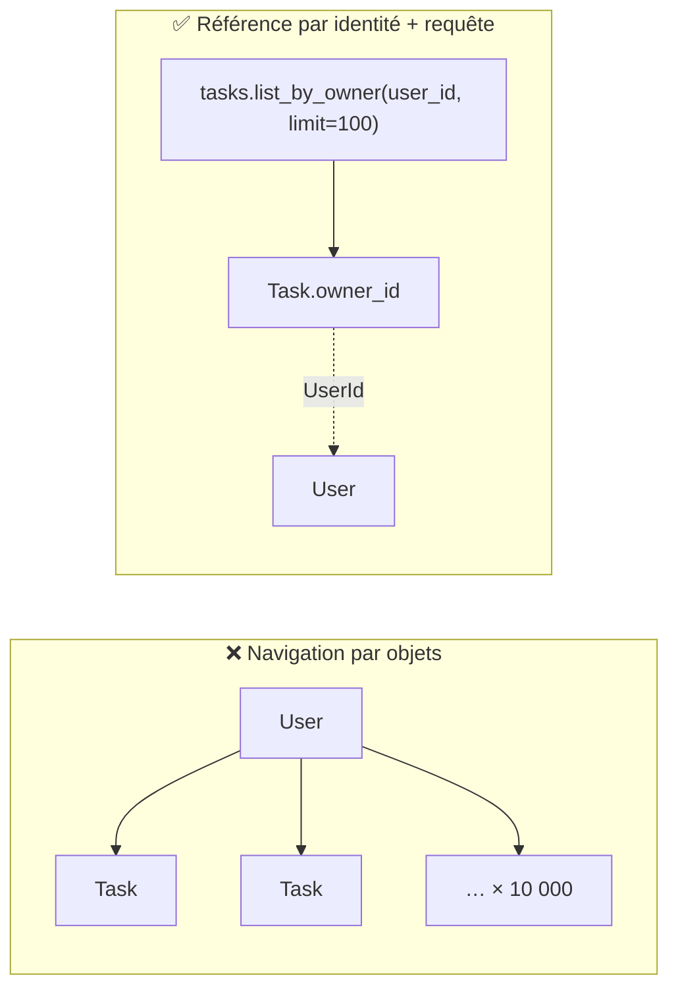
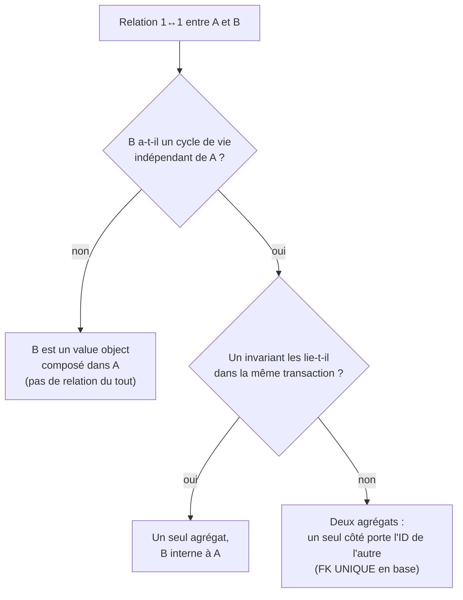

# 05. Relations entre agrégats

> **TL;DR** — **Entre** agrégats : référence par identité, et « les enfants d'un
> parent » devient une requête. **Dans** un agrégat : les objets se référencent
> normalement. La jointure SQL est un détail d'infrastructure ; en async, charge
> les relations explicitement.

Le [chapitre 04](04-les-agregats.md) a posé les frontières. Ce chapitre traite ce
qui les traverse.

## La règle et sa portée exacte

> Un agrégat en référence un autre **par son identité**, jamais par l'objet.

Formulée ainsi, elle est souvent mal comprise. La version complète :

> On ne traverse pas les frontières **entre** agrégats par navigation d'objets.
> **À l'intérieur** d'un agrégat, les objets se référencent directement et
> forment des collections quand c'est naturel.

```python
# domain/task/entities.py
class Task:
    def __init__(self, *, id: TaskId, owner_id: UserId, ...):
        self.owner_id = owner_id     # ✅ une IDENTITÉ, pas un objet User
```

Et symétriquement, `User` ne porte pas la collection de ses tâches.

Les trois raisons, par ordre d'importance :

1. **Frontière de cohérence.** C'est la vraie raison ([ch. 04](04-les-agregats.md)) :
   `User` et `Task` n'ont pas à être cohérents dans la même transaction.
2. **Découplage.** Le contexte `task` n'a besoin ni du nom ni de l'e-mail du
   propriétaire pour appliquer ses règles — seulement de savoir *à qui* la tâche
   appartient.
3. **Volume.** Un user peut avoir 10 000 tâches. Une collection en mémoire n'a
   aucun sens.

## « Les tâches d'un user » est une requête

Puisque `User` ne porte pas ses tâches, on les obtient par une requête explicite.
Pour servir un écran, elle vit naturellement sur un port applicatif et retourne
un read model :

```python
# application/task/queries.py
async def list_by_owner(
    self, owner_id: str, *, limit: int = 100, offset: int = 0
) -> list[TaskSummary]: ...
```

Une recherche sur le repository domaine ne se justifie que si l'appelant doit
charger les agrégats pour protéger leurs invariants. La navigation « user → ses
tâches » reste un **appel explicite** : le coût et l'intention de la requête sont
visibles dans le code qui la déclenche.



## Où vit la vraie jointure ? Dans l'infrastructure

La relation relationnelle (clé étrangère, jointure SQL) est un **détail
d'infrastructure**. Elle n'apparaît qu'au niveau ORM :

```python
# infrastructure/persistence/task/models.py
owner_id: Mapped[uuid.UUID] = mapped_column(
    ForeignKey("users.id", ondelete="CASCADE"), index=True
)
```

Le domaine ignore cette clé étrangère : il ne connaît qu'un `UserId`. L'index,
lui, n'est pas décoratif — sans lui, `list_by_owner` fait un *seq scan* sur toute
la table.

## Qui vérifie que le user existe ?

La FK garantit l'intégrité **en base**, mais provoquerait une erreur technique
illisible. On veut une erreur métier claire, donc le use case vérifie
([ch. 02](02-ou-vit-une-regle.md)) :

```python
if not await self._users.exists(owner_id):
    raise UserNotFound(str(owner_id))
```

Comme pour l'unicité d'e-mail : le use case donne le **message**, la base donne
la **garantie**.

## Le piège du N+1 (côté lecture)

Si tu charges un `User` **avec** ses tâches pour une vue de lecture, attention :
en SQLAlchemy **async**, déclencher implicitement de l'I/O par un simple accès
d'attribut est problématique et lève couramment une erreur. Le choix le plus clair
pour une vue reste un chargement explicite :

```python
select(UserModel).options(selectinload(UserModel.tasks))   # 1 requête (+1), pas N
```

Sans ça, afficher 100 users avec leurs tâches déclencherait 101 requêtes : le
fameux **N+1**. Noter que cette `relationship` vit dans les **modèles ORM**, pas
dans le domaine — c'est un outil de lecture de l'infrastructure, pas une
navigation d'agrégats.

## Vue jointe en lecture ? Query service

Pour afficher « la tâche + le nom de son propriétaire », ne reconstruis pas deux
agrégats. C'est une **lecture** : un service de requête dédié fait un `SELECT …
JOIN` et retourne directement un DTO de lecture. Détaillé au
[chapitre 09](09-lectures-et-query-services.md#anatomie-dun-query-service).

## Les autres cardinalités

Le principe directeur ne change pas : **entre agrégats, référence par identité ;
la jointure est un détail d'infra.** Seule la *forme* de la référence change.
(Les exemples ci-dessous sont illustratifs ; ce dépôt n'implémente que le 1→n.)

### n→1 : déjà fait

Un `n→1` est un `1→n` vu de l'autre côté, et c'est exactement ce que le projet
implémente : `Task.owner_id` est le côté « plusieurs ». Rien de nouveau.

En pratique, quand deux agrégats sont en relation 1→n, c'est **presque toujours**
l'enfant qui porte l'identité du parent. Pas par dogme, mais parce que la
collection côté parent bute sur les trois raisons du début (cohérence,
découplage, volume).

> **La nuance qui compte** — si tu te dis « mais `Order` porte bien ses
> `lines` ! », relis le [chapitre 04](04-les-agregats.md#lexemple-canonique--order--orderline) :
> `OrderLine` est *dans* l'agrégat `Order`. Ce n'est pas une relation entre
> agrégats, donc cette section ne s'y applique pas. La question à trancher
> d'abord est toujours : **une frontière ou deux ?**

### 1↔1 : d'abord, est-ce vraiment deux agrégats ?

Face à un `1↔1`, la première question n'est pas « comment le mapper » mais
« devrait-ce être **un seul** agrégat ? ».



- **`User` ↔ `Address`** → l'adresse est un value object *dans* `User`. Pas de
  relation, de la composition.
- **`User` ↔ `BillingAccount`** (gérés séparément, cycles de vie distincts) →
  deux agrégats, **un seul côté** porte l'identité de l'autre. On évite les
  références mutuelles (A→B *et* B→A), qui recréent le couplage circulaire qu'on
  cherchait à éviter.

Par défaut, penche pour **fusionner**. Ne sépare que si tu as une vraie raison.

### n↔n : deux stratégies

1. **Collection d'identités**, si les ensembles sont petits et que la relation ne
   porte **aucune donnée** propre :

   ```python
   class Article:
       def __init__(self, ..., tag_ids: set[TagId]) -> None:
           self._tag_ids = tag_ids        # des IDENTITÉS, pas des objets Tag
   ```

2. **Réifier la relation en agrégat** — dès que la relation **porte ses propres
   attributs**. `Student ↔ Course` avec une date d'inscription et une note n'est
   pas une association : c'est un concept métier que le langage ubiquitaire nomme
   probablement déjà.

   ```python
   class Enrollment:                       # la relation DEVIENT un agrégat
       student_id: StudentId
       course_id: CourseId
       enrolled_at: datetime
       grade: Grade | None

       def assign_grade(self, grade: Grade) -> None:
           if self.grade is not None:
               raise GradeAlreadyAssigned()  # un invariant : c'est bien une entité
   ```

   **Le déclencheur de la réification** : dès que tu veux « stocker quelque chose
   sur la relation », ou qu'une règle porte sur la relation elle-même, ce n'est
   plus une relation — c'est un concept.

> **Le piège n↔n** : ne jamais modéliser ça comme deux collections d'objets qui
> se pointent mutuellement (`user.roles` ↔ `role.users`). C'est ce qui fait
> exploser le chargement et dissout les frontières d'agrégats. En base, un n↔n
> devient une table de jointure — un détail d'infrastructure, comme toujours.

### Récapitulatif des cardinalités

| Relation | Modélisation domaine | Infra |
|----------|----------------------|-------|
| Objets du **même** agrégat | collection d'objets réels via la racine | table enfant, cascade |
| 1→n / n→1 (2 agrégats) | l'enfant porte `parent_id: ParentId` | FK **indexée** |
| 1↔1 (2 agrégats) | un seul côté porte l'ID de l'autre | FK `UNIQUE` |
| 1↔1 (en fait 1) | value object composé dans l'agrégat | colonnes inline |
| n↔n (sans données) | collection d'`Id` d'un côté | table de jointure |
| n↔n (avec données) | agrégat de relation réifié (`Enrollment`) | table-entité |

## La relation, couche par couche

Pour le 1→n de ce projet :

| Couche | Comment la relation apparaît |
|--------|------------------------------|
| Domain | Par identité : `Task.owner_id: UserId`. Aucune collection dans `User`. |
| Application | Use cases dépendant de deux ports (vérification d'existence). |
| Infrastructure | La vraie jointure : `ForeignKey`, `relationship`, `selectinload`. |
| Presentation | Routes imbriquées `/users/{id}/tasks` ; le DTO expose `owner_id`. |

## À retenir

- **Entre** agrégats : référence par identité. **Dans** un agrégat : objets et
  collections, normalement.
- La raison profonde est la **frontière de cohérence**, pas une interdiction des
  collections.
- « Les enfants d'un parent » = une **requête** paginée, pas un attribut.
- **1↔1** : demande-toi d'abord si ce n'est pas un seul agrégat (souvent un VO).
- **n↔n** : collection d'IDs si trivial ; **réifie** dès que la relation porte
  des données ou une règle.
- La jointure SQL est un détail d'infra ; en async, charge explicitement
  (`selectinload`) pour éviter le N+1.

## À toi de jouer

1. On veut afficher, sur la page d'un user, son nom et le nombre de ses tâches
   terminées. Trois implémentations sont possibles : `list_by_owner` puis compte
   en Python, une méthode `count_completed_by_owner` sur le port, ou un query
   service. Laquelle choisis-tu et sur quel critère ?
2. Un collègue ajoute `tasks: list[Task]` à `User` « juste pour les tests ».
   Cite trois problèmes concrets que ça crée dans **ce** projet.
3. `Enrollment` porte `student_id` et `course_id`. Pourquoi n'est-ce pas
   simplement un value object ?

→ [Corrigés](14-annexes.md#c-corrigés-des-exercices)
