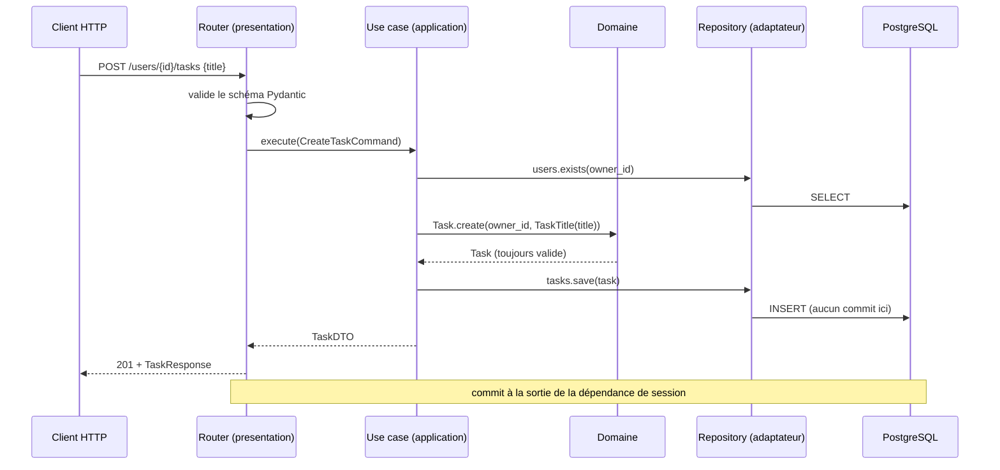

# 06. Application & ports

> **TL;DR** — La couche application **orchestre** : elle enchaîne les appels, ne
> porte pas les invariants du domaine. Un **port** appartient à la couche qui
> *exprime le besoin*. Ce template place les repositories d'agrégats dans le
> domaine ; une application qui seule exprime ce besoin peut tout aussi bien les
> déclarer dans `application/`. Les **DTO** isolent des frameworks des deux côtés.

## Les ports : qui déclare le besoin ?

Un **port** est une interface qui exprime un besoin sans dire comment il sera
satisfait. La question intéressante est : **dans quelle couche le déclarer ?**

La réponse tient en une question :

> **Qui a besoin de ce concept ?**

- Le concept « je dois pouvoir retrouver une `Task` par son identité » est
  exprimé en **termes du domaine** : il parle de `Task` et de `TaskId`, pas de
  lignes ni de tables. Ce projet place donc le port dans
  `domain/task/repository.py`.

  > Attention à la formulation : ça ne veut **pas** dire que la persistance est
  > une propriété du domaine. Un modèle métier n'a pas besoin d'être persisté
  > pour être juste. Ce que dit ce choix, très classique en DDD, c'est que le
  > **cycle de vie des agrégats** fait partie du modèle que l'application
  > manipule, et que l'abstraction qui le décrit s'exprime dans le vocabulaire du
  > domaine. D'autres architectures, tout aussi cohérentes, placent les ports de
  > persistance dans la couche application.
- Le concept « je mets certaines lectures en cache » n'appartient à personne dans
  le métier. Aucun invariant de `Task` ou de `User` n'en dépend. C'est une
  **décision de cas d'usage**. Le port vit dans `application/shared/cache.py`.

C'est exactement ce que fait ce projet :

| Port | Emplacement | Pourquoi là |
|------|-------------|-------------|
| `TaskRepository`, `UserRepository` | `domain/<ctx>/repository.py` **dans ce template** | Choix DDD classique pour le cycle de vie des agrégats ; `application/` reste cohérent si les use cases portent seuls le besoin |
| `CachePort` | `application/shared/cache.py` | Optimisation de lecture décidée par les use cases |
| `SMTPSenderPort` | `application/shared/smtp.py` | Notification : effet applicatif, pas invariant métier |
| `EventPublisherPort` | `application/shared/messaging.py` | Intégration : idem |
| `EmailTemplatePort` | `application/shared/html_template/` | Rendu du message : détail de présentation |

| Concept | Ce que dit le principe | Ce que fait ce projet |
|---------|------------------------|-----------------------|
| Emplacement d'un port | Le port appartient à la couche qui **exprime le besoin** | Repositories dans `domain/`, ports techniques dans `application/shared/` |

**C'est le point où beaucoup de cours se trompent** en assénant « les ports sont
dans le domaine ». Ce serait faux ici : mettre `CachePort` dans `domain/`
signifierait que le modèle métier des tâches a une opinion sur le cache. Il n'en
a aucune.

Dans **ce template**, le port de persistance est dans le domaine : le domaine
possède l'interface, l'infrastructure lui obéit. L'inversion de dépendance exige
surtout que l'implémentation dépende du port ; elle n'impose pas universellement
que tout repository vive dans `domain/`.

```python
# domain/task/repository.py
class TaskRepository(ABC):
    @abstractmethod
    async def save(self, task: Task) -> None: ...
    @abstractmethod
    async def get(self, task_id: TaskId) -> Task: ...
    @abstractmethod
    async def delete(self, task_id: TaskId) -> None: ...
    @abstractmethod
    async def exists(self, task_id: TaskId) -> bool: ...
```

### Ce qu'un port ne doit pas exposer

Un port fuit dès qu'il laisse transparaître son implémentation. Deux exemples du
projet, tous deux commentés dans le code :

- `EventPublisherPort` n'expose que `publish` — ni `connect`, ni `close`. Le
  cycle de vie de la connexion AMQP est un détail d'infrastructure, ouvert dans
  le `lifespan` de l'API ou au démarrage du worker.
- **Il parle en événement typé, pas en `dict`** :

  ```python
  async def publish(self, event: IntegrationEvent) -> None: ...
  ```

  Une signature `publish(routing_key: str, payload: dict[str, Any])` serait déjà
  une fuite : elle oblige le use case à sérialiser lui-même et à connaître une
  *clé de routage*, qui est du vocabulaire AMQP. Ici l'événement porte son propre
  type (`ShareTaskNotification.name = "task.shared"`), et c'est l'adaptateur qui
  décide d'en faire une clé de routage — un adaptateur Kafka en ferait un topic.

Un port qui exposerait `execute(sql: str)` ou `get_session()` ne serait pas un
port : ce serait SQLAlchemy déguisé.

### Typé ou opaque ? Le cas du cache

Une nuance qui surprend : `CachePort`, lui, parle bien en `dict` JSON-compatible.
Est-ce incohérent avec ce qu'on vient de dire ? Non — les deux ports n'ont pas la
même nature de contrat.

| | `EventPublisherPort` | `CachePort` |
|---|---|---|
| Qui lit la donnée | **un autre process** (le worker) | le même use case, plus tard |
| Durée de vie | contrat public, versionné | éphémère, jetable |
| Conséquence d'un changement de forme | il faut coordonner deux déploiements | rien : au pire un cache miss |
| Typage utile ? | **oui**, c'est une interface entre composants | non, ce serait de la cérémonie |

La règle générale n'est donc pas « toujours typer » ni « toujours `dict` », mais :
**un contrat lu par quelqu'un d'autre se type ; un détail privé et jetable peut
rester opaque.**

### Et la pagination ? Et le tri ?

`limit` / `offset` sont une **policy applicative** légitime. C'est justement
pourquoi une liste paginée destinée à un endpoint vit naturellement sur un port
de query service dans `application/`, qui retourne des read models :

```python
class TaskQueries(ABC):
    async def list_by_owner(
        self, owner_id: str, *, limit: int = 100, offset: int = 0
    ) -> list[TaskSummary]: ...
```

Le repository d'agrégat reste centré sur `get`, `save`, `delete`. Une recherche
qui retourne des agrégats n'y entre que si l'appelant doit réellement les charger
pour protéger des invariants. Et `ORDER BY ... NULLS LAST` n'a sa place dans
aucune signature : si l'ordre est métier, nomme la politique en langage métier.

## Le use case : orchestrer

Un use case reçoit ses ports à la construction et expose `execute`. Il enchaîne :
charger → appeler le domaine → sauvegarder.

```python
# application/task/use_cases/complete_task.py
class CompleteTask:
    def __init__(self, repository: TaskRepository) -> None:
        self._repository = repository

    async def execute(self, task_id: str) -> TaskDTO:
        task = await self._repository.get(TaskId.from_string(task_id))
        task.complete()                       # ← la décision est DANS le domaine
        await self._repository.save(task)
        return TaskDTO.from_entity(task)
```

La décision (« peut-on compléter ? ») n'est pas ici : elle est dans
`task.complete()`. Le use case coordonne.

> **Rappel de nuance** ([ch. 02](02-ou-vit-une-regle.md)) : « le use case ne
> contient pas de règle » est une simplification. Il ne contient pas les
> **invariants du domaine**. Il peut porter la **policy du cas d'usage**.

### Orchestration inter-agrégats

Quand une action touche plusieurs agrégats, le use case dépend de plusieurs
ports :

```python
# application/task/use_cases/create_task.py
class CreateTask:
    def __init__(self, tasks: TaskRepository, users: UserRepository) -> None:
        self._tasks = tasks
        self._users = users

    async def execute(self, command: CreateTaskCommand) -> TaskDTO:
        owner_id = UserId.from_string(command.owner_id)
        if not await self._users.exists(owner_id):
            raise UserNotFound(str(owner_id))         # cohérence référentielle
        task = Task.create(owner_id=owner_id, title=TaskTitle(command.title))
        await self._tasks.save(task)
        return TaskDTO.from_entity(task)
```

C'est la couche application qui coordonne des règles impliquant plusieurs
agrégats — le domaine garde chaque agrégat cohérent isolément.

### Combiner ports métier et ports techniques

`GetUser` montre le mélange, et le contrat qui va avec :

```python
# application/user/use_cases/get_user.py
class GetUser:
    def __init__(self, repository: UserRepository, cache: CachePort) -> None: ...

    async def execute(self, user_id: str) -> UserDTO:
        identity = UserId.from_string(user_id)   # valider AVANT de toucher au cache
        key = f"user:{identity}"

        cached = await self._cache.get(key)
        if cached is not None:
            return self._from_cache(cached)

        user = await self._repository.get(identity)
        dto = UserDTO.from_entity(user)
        await self._cache.set(key, asdict(dto))
        return dto
```

Trois détails qui font la différence entre « ça marche » et « c'est correct » :

- **L'identité est validée avant le cache** : un ID syntaxiquement invalide ne
  déclenche aucune lecture et ne crée aucune entrée.
- **Le contrat d'invalidation est écrit dans le docstring** : la clé est
  `user:{id}`, et toute mutation d'un `User` doit la supprimer — c'est ce que
  fait `RenameUser`. Un cache dont personne ne documente l'invalidation est un
  bug qui attend son heure.
- **La reconstruction depuis le cache est explicite** (`_from_cache`) : JSON ne
  connaît pas `datetime`, il faut re-parser.

## Les DTO : découpler l'application de ses frontières

Un use case ne renvoie pas une entité du domaine à l'API, et ne reçoit pas un
schéma Pydantic — le premier couplerait le contrat public au modèle métier, le
second ferait entrer le framework web dans l'application. On utilise des **DTO** :
des structures neutres.

```python
# application/task/dto.py
@dataclass(frozen=True, slots=True)
class CreateTaskCommand:        # entrée : une « commande »
    owner_id: str
    title: str
    description: str | None = None

@dataclass(frozen=True, slots=True)
class TaskDTO:                  # sortie
    id: str
    owner_id: str
    title: str
    # …
    @classmethod
    def from_entity(cls, task: Task) -> TaskDTO: ...
```

Pourquoi ne pas exposer l'entité directement ? Trois raisons concrètes :

1. **Couplage de contrat.** Renommer un attribut du domaine casserait l'API
   publique. Le DTO absorbe ce genre de changement.
2. **Fuite d'état interne.** Une entité expose des méthodes de mutation
   (`complete`, `rename`) qui n'ont aucun sens dans une réponse HTTP.
3. **Sérialisation.** Le DTO parle en types simples (`str`, `datetime`), pas en
   value objects — ce qui le rend trivial à sérialiser… et à mettre en cache.

Un DTO qui contiendrait `owner: User` raterait sa cible : il réintroduirait la
navigation entre agrégats écartée au [chapitre 05](05-relations-entre-agregats.md).

### Le piège inverse : la cérémonie

Tout ce chapitre justifie des traductions successives. Il faut aussi savoir
quand elles deviennent absurdes. Compte les représentations d'un même concept
dans ce projet :

```text
CreateUserRequest    (schéma HTTP, presentation)
CreateUserCommand    (DTO d'entrée, application)
User                 (entité, domain)
UserDTO              (DTO de sortie, application)
UserResponse         (schéma HTTP, presentation)
UserModel            (modèle ORM, infrastructure)
```

**Six classes pour transporter un nom et un e-mail.** Pour un système durable
avec un métier riche, c'est parfaitement raisonnable : chacune a une raison de
changer différente, et c'est précisément ce qui permet de faire évoluer l'API
sans toucher au domaine. Pour un CRUD administratif de 400 lignes qui ne
grossira jamais, c'est absurde — et le dire fait partie du cours.

Trois questions pour trancher, à poser objet par objet et non en bloc :

1. **Ces deux représentations ont-elles des raisons de changer différentes ?**
   Si le schéma HTTP et le DTO d'entrée changeront toujours ensemble et pour la
   même raison, l'un des deux est du bruit.
2. **Y a-t-il un deuxième appelant, réel ou probable ?** Le CLI et le worker de
   ce projet justifient à eux seuls `CreateUserCommand` : sans lui, ils
   dépendraient d'un objet Pydantic conçu pour HTTP.
3. **Le domaine a-t-il une forme différente du transport ?** `User` porte des
   value objects (`Email`, `UserName`) ; `UserResponse` porte des `str`. Quand
   les deux formes sont identiques champ pour champ et pour toujours, le mapper
   ne protège rien.

La tension entre isolation et cérémonie ne se résout pas une fois pour toutes :
elle se rejuge à chaque couche ajoutée. Le [chapitre 13](13-demarrer-un-projet.md#et-lentre-deux-)
propose une progression graduée plutôt qu'un choix tout-ou-rien.

## Le flux complet d'une requête



Le use case est testable sans FastAPI ni base : on lui passe une
`CreateTaskCommand` et des ports en mémoire, on vérifie le `TaskDTO` renvoyé.
C'est exactement ce que fait `tests/unit/application/`
([ch. 12](12-organisation-et-tests.md)).

## À retenir

- Un **port** appartient à la couche qui **exprime le besoin** : `domain/` pour
  les repositories, `application/` pour cache, SMTP, broker.
- Un port ne laisse pas fuiter son implémentation (pas de `connect`, pas de SQL).
- Le **use case orchestre** : il ne porte pas les invariants, il peut porter la
  policy du cas d'usage.
- Une action multi-agrégats → un use case dépendant de plusieurs ports.
- Les **DTO** isolent l'application des frameworks des deux côtés, et évitent de
  réintroduire la navigation entre agrégats.

## À toi de jouer

1. Nouveau besoin : « à la création d'un user, envoyer un e-mail de bienvenue ».
   **a.** dans quelle couche déclares-tu le port ? **b.** pourquoi pas dans
   `domain/user/` ? **c.** si l'envoi échoue, la création doit-elle être annulée —
   et que t'apprend ta réponse sur le placement ? **d.** quelle alternative
   choisirais-tu si l'envoi devenait lent ou peu fiable ?
2. `CachePort` expose `get`, `set`, `delete`, `ping`. Pourquoi `ping` est-il un
   cas limite discutable — et qu'est-ce qui le justifie malgré tout ?
3. Un collègue propose de remplacer `CreateTaskCommand` par le schéma Pydantic
   `CreateTaskRequest`, « pour éviter la duplication ». Quel contrat
   import-linter casse, et que perd-on côté CLI et worker ?

→ [Corrigés](14-annexes.md#c-corrigés-des-exercices)
