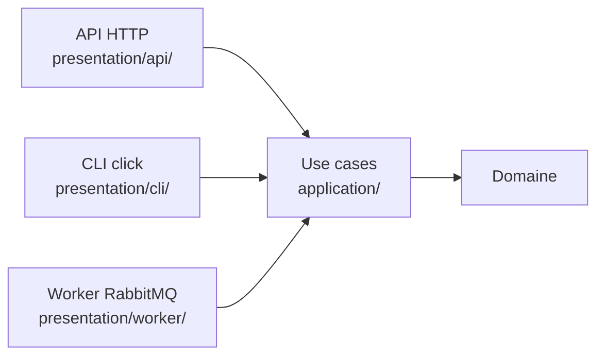

# 07. Les adaptateurs

> **TL;DR** — Un adaptateur **traduit**, il ne décide pas. Côté driven :
> l'entité et le modèle ORM sont deux classes reliées par un mapper, et le
> repository ne commite pas. Côté driving : ce projet en a trois (API, CLI,
> worker), qui appellent tous les mêmes use cases.

Les adaptateurs sont le monde extérieur branché sur le cœur. Ils implémentent ou
consomment les ports, et ne contiennent **aucun invariant métier**.

## Côté driven : la persistance

### Le modèle ORM n'est pas l'entité du domaine

Tentation constante : utiliser la même classe pour l'entité métier et la ligne de
base. Ce projet les sépare **volontairement**. `Task` (domaine) et `TaskModel`
(SQLAlchemy) sont deux classes distinctes.

```python
# infrastructure/persistence/task/models.py
class TaskModel(Base):
    __tablename__ = "tasks"
    id: Mapped[uuid.UUID] = mapped_column(Uuid, primary_key=True)
    owner_id: Mapped[uuid.UUID] = mapped_column(
        ForeignKey("users.id", ondelete="CASCADE"), index=True
    )
    title: Mapped[str] = mapped_column(String(200))
    # …
```

**Le coût est réel** : deux classes à maintenir, un mapper à écrire, un test de
plus quand on ajoute un champ. Autant l'assumer plutôt que le nier. Ce qu'on
achète :

- le domaine n'importe pas SQLAlchemy — sans quoi le contrat `forbidden`
  d'import-linter échoue, et surtout tester une règle exigerait un moteur de base ;
- les contraintes de la base (types de colonnes, nullabilité, cascades) ne
  déteignent pas sur le modèle métier ;
- une entité peut être *plus riche* que sa table : encapsulation, value objects,
  invariants, factories — choses qu'un modèle déclaratif ORM exprime mal ;
- une migration de schéma ne touche pas au domaine.

Si le domaine est un CRUD sans règles, ce coût n'achète rien — c'est précisément
un des signaux du [chapitre 13](13-demarrer-un-projet.md#quand-ne-pas-utiliser-cette-architecture).

### Les mappers : traduire dans les deux sens

Un **mapper** convertit entité ↔ modèle. C'est le seul endroit qui connaît les
deux formes.

```python
# infrastructure/persistence/task/mappers.py
def to_domain(model: TaskModel) -> Task:          # ORM → domaine
    return Task(
        id=TaskId(model.id),
        owner_id=UserId(model.owner_id),
        title=TaskTitle(model.title),
        # …
    )

def to_model(task: Task) -> TaskModel:            # domaine → ORM
    return TaskModel(id=task.id.value, owner_id=task.owner_id.value, ...)
```

Remarque `to_domain` : il utilise le **constructeur** de `Task`, pas la factory
`Task.create()`. Reconstituer une tâche existante n'est pas en créer une neuve
([ch. 03](03-le-domaine.md#les-factories--construire-un-objet-valide)) — on ne
veut ni régénérer l'identité ni réinitialiser `created_at`.

### Le repository : implémenter le port

```python
# infrastructure/persistence/task/repository.py
class SqlAlchemyTaskRepository(TaskRepository):
    def __init__(self, session: AsyncSession) -> None:
        self._session = session          # session INJECTÉE, jamais créée ici

    async def get(self, task_id: TaskId) -> Task:
        model = await self._session.get(TaskModel, task_id.value)
        if model is None:
            raise TaskNotFound(str(task_id))    # erreur métier, pas None
        return mappers.to_domain(model)
```

Trois règles de conduite pour un repository :

1. **Il ne crée pas sa session, il la reçoit.** Sinon deux repositories d'un même
   use case travailleraient dans deux transactions différentes.
2. **Il ne commite pas.** La frontière transactionnelle est ailleurs
   ([ch. 08](08-transactions-et-erreurs.md)).
3. **Il traduit les absences en erreurs métier.** `get` lève `TaskNotFound` ;
   c'est `exists` qui répond par un booléen quand l'appelant veut tester.

### Deux pièges SQLAlchemy rencontrés ici

- **Relations inter-fichiers.** `TaskModel.owner` ↔ `UserModel.tasks` se
  résolvent par *nom de classe* via le registre SQLAlchemy : le modèle cible est
  importé sous `TYPE_CHECKING` seulement, et `init_db` importe les deux modules
  `models` pour les enregistrer. La FK, elle, référence la table par chaîne
  (`"users.id"`) et n'a besoin d'aucun import.
- **Ne pas masquer le builtin `list`.** Une méthode `list()` dans une classe fait
  que toute annotation `list[T]` **écrite après elle** se résout vers la méthode
  (erreur mypy). D'où l'ordre dans `TaskRepository` : `list_by_owner` est déclarée
  **avant** `list`, avec un commentaire pour que personne ne « range » les
  méthodes par ordre alphabétique.

## Côté driving : trois adaptateurs, les mêmes use cases

C'est la démonstration la plus parlante de l'architecture : le même `CreateUser`
est appelé par l'API et par le CLI, sans une ligne d'adaptation.



### L'API HTTP

**Les schémas Pydantic sont le contrat du transport.** Ici, Pydantic est
exactement à sa place : valider et sérialiser ce qui entre et sort en HTTP.

```python
# presentation/api/v1/schemas/task.py
class CreateTaskRequest(BaseModel):
    title: str = Field(..., min_length=1, max_length=TITLE_MAX_LENGTH)
    description: str | None = None
```

**Le router traduit HTTP ↔ use case**, rien de plus :

```python
# presentation/api/v1/routers/users.py
@router.post("/{user_id}/tasks", status_code=201)
async def create_task_for_user(
    user_id: str,
    payload: CreateTaskRequest,
    use_case: Annotated[CreateTask, Depends(get_create_task)],
) -> TaskResponse:
    dto = await use_case.execute(
        CreateTaskCommand(owner_id=user_id, title=payload.title, description=payload.description)
    )
    return TaskResponse.from_dto(dto)
```

Aucun `if` métier, aucun accès base, aucun `try/except` sur les erreurs du
domaine — celles-ci sont traitées globalement
([ch. 08](08-transactions-et-erreurs.md)).

### Le CLI

```python
# presentation/cli/app.py
async def _create_user(name: str, email: str) -> None:
    async with transactional_session() as session:
        use_case = CreateUser(repository=SqlAlchemyUserRepository(session))
        result = await use_case.execute(CreateUserCommand(name=name, email=email))
    click.echo(f"Utilisateur créé : {result.id}")
```

Même use case, même domaine, mêmes règles. Ce qui change : le CLI **construit
lui-même** ses dépendances (pas de conteneur DI) et fournit **sa propre**
frontière transactionnelle. C'est la preuve, en 8 lignes, que le métier ne
dépendait pas de HTTP.

### Le worker RabbitMQ

Le worker est un adaptateur driving un peu particulier : il est déclenché par un
message plutôt que par un humain.

```python
# presentation/worker/__main__.py (simplifié)
async def wrapper(incoming: aio_pika.abc.AbstractIncomingMessage) -> None:
    async with session_factory() as session:
        use_case = NotifyTaskShared(
            task_repository=SqlAlchemyTaskRepository(session),
            user_repository=SqlAlchemyUserRepository(session),
            smtp_sender=smtp_sender,
            email_template=email_template,
            from_email=settings.smtp_from_email,
        )
        try:
            await process_message(incoming, use_case, dlx)
            await session.commit()
        except Exception:
            await session.rollback()
            raise
```

Il illustre deux choses que l'API ne montre pas :

- **une transaction par message**, et non par requête — même principe, autre
  déclencheur ([ch. 08](08-transactions-et-erreurs.md)) ;
- **la gestion des échecs propre à ce canal** : deux filets de sécurité
  complémentaires alimentent la *dead-letter queue* — un `publish` applicatif
  pour les échecs SMTP **partiels** (le message est traité et acquitté, mais
  certains destinataires n'ont rien reçu), et la DLX native de RabbitMQ pour les
  messages rejetés ou les exceptions non gérées. Cette logique de retry est
  purement **adaptateur** : ni le use case ni le domaine n'en savent rien.

## Deux validations, deux rôles (ne pas confondre)

Le `min_length=1` du schéma HTTP **et** le `EmptyTitle` du value object ne font
pas la même chose :

| | Schéma Pydantic | Value object |
|---|---|---|
| Rôle | Filtrer le transport, produire un 422 propre | Garantir l'invariant métier |
| Portée | Les appelants HTTP | **Tous** les appelants (API, CLI, worker, tests) |
| Peut-on l'enlever ? | Oui, l'erreur devient juste moins jolie | Non, la règle disparaîtrait |

La **source de vérité est le domaine** ; le schéma est un filtre ergonomique en
façade. La démonstration tient dans un cas limite :

```python
{"title": "   "}     # passe min_length=1 (3 caractères !) → rejeté par TaskTitle
```

Ce n'est donc pas une duplication fautive : ce sont deux garde-fous à deux
altitudes différentes.

## À retenir

- Modèle ORM et entité domaine sont **séparés**, reliés par un **mapper** — un
  coût assumé, pas un dogme gratuit.
- Un repository **reçoit** sa session, ne **commite pas**, et traduit les
  absences en **erreurs métier**.
- Le mapper reconstitue via le **constructeur**, pas la factory.
- Les **schémas** Pydantic sont le contrat HTTP, distincts des **DTO** applicatifs.
- Trois adaptateurs driving appellent les mêmes use cases : c'est la preuve
  opérationnelle de l'isolation du cœur.
- Un adaptateur peut contenir de la logique **technique** riche (DLQ, retry) —
  jamais de la logique **métier**.

## À toi de jouer

1. Le mapper `to_domain` construit `TaskTitle(model.title)`. Que se passe-t-il si
   une ligne en base contient un titre vide (insérée par un script SQL) — et
   est-ce un bug du mapper ?
2. On veut exposer les tâches en CSV plutôt qu'en JSON. Quels fichiers changent ?
   Combien de lignes dans `domain/` et `application/` ?
3. Un collègue ajoute `await self._session.commit()` à la fin de
   `SqlAlchemyTaskRepository.save()` « pour être sûr ». Décris précisément ce que
   ça casse dans le worker.

→ [Corrigés](14-annexes.md#c-corrigés-des-exercices)
