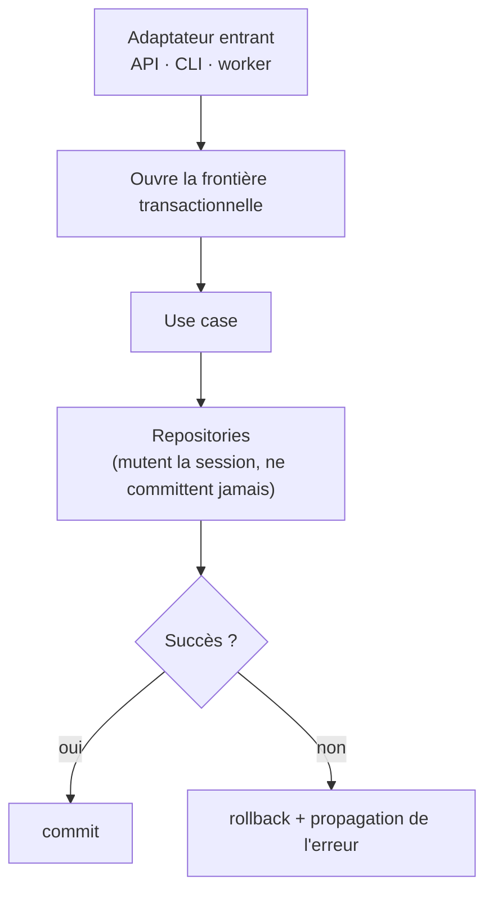
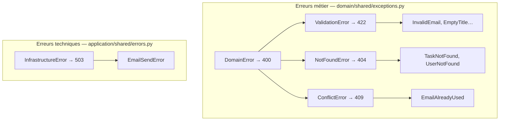

# 08. Transactions, erreurs & câblage

> **TL;DR** — La transaction entoure le **use case**, pas le repository ; chaque
> adaptateur entrant fournit cette frontière à sa manière. Les erreurs **métier**
> et les erreurs **techniques** ont deux hiérarchies distinctes, mappées
> différemment en HTTP. La **composition root** est le point où les
> implémentations concrètes sont assemblées avec les abstractions qu'elles
> réalisent.

Trois préoccupations traversent toutes les couches. Elles se traitent une fois,
au bon endroit.

## 1. La frontière transactionnelle

### La règle, correctement formulée

Qui décide du `commit` / `rollback` ? **Pas le repository.** Sinon un use case
qui fait deux écritures ne pourrait pas les rendre atomiques.

La formulation qu'on lit souvent — *« la transaction, c'est la requête HTTP »* —
est trompeuse : elle est vraie de l'API, et fausse dès qu'un autre canal existe.
La bonne formulation est :

> **La transaction entoure le use case.** Chaque adaptateur entrant fournit cette
> frontière avec les moyens de son canal.



### Les trois implémentations de ce projet

Même principe, trois déclencheurs :

```python
# 1. API — presentation/api/dependencies/session.py : une transaction par requête
async def get_session(request: Request) -> AsyncIterator[AsyncSession]:
    session_factory = request.app.state.session_factory
    async with session_factory() as session:
        try:
            yield session
            await session.commit()
        except Exception:
            await session.rollback()
            raise
```

```python
# 2. CLI — presentation/cli/app.py : une transaction par commande
@asynccontextmanager
async def transactional_session() -> AsyncIterator[AsyncSession]:
    ...
    async with session_factory() as session:
        try:
            yield session
            await session.commit()
        except Exception:
            await session.rollback()
            raise
```

```python
# 3. Worker — presentation/worker/__main__.py : une transaction par message
async with session_factory() as session:
    use_case = NotifyTaskShared(...)
    try:
        await process_message(incoming, use_case, dlx)
        await session.commit()
    except Exception:
        await session.rollback()
        raise
```

Trois fois le même schéma, trois cycles de vie différents. **C'est ça, la
frontière transactionnelle du use case** — et c'est pour ça qu'il faut se méfier
des formules qui la collent au protocole.

| Concept | Ce que dit le principe | Ce que fait ce projet |
|---------|------------------------|-----------------------|
| Frontière transactionnelle | Entoure l'unité de travail (le use case) | Fournie par chaque adaptateur entrant : dépendance FastAPI, context manager CLI, wrapper de message |
| Gestion transactionnelle | Une responsabilité à situer explicitement | Repositories sans commit + session injectée ≈ *Unit of Work* léger |

### Ce que ce choix te donne

Un use case peut enchaîner plusieurs écritures dans **une seule transaction
atomique**, sans le savoir. Il ne connaît ni `commit`, ni `rollback`, ni même
`AsyncSession` — il ne voit que des ports.

C'est une forme légère d'***Unit of Work*** : le pattern où une unité de travail
regroupe les modifications et les valide d'un bloc. D'autres modèles existent —
Unit of Work explicite passé au use case, décorateur `@transactional`, transaction
script — et sont tout aussi défendables. Ce qui compte est que la
**responsabilité transactionnelle soit située et unique**, pas la forme exacte.

### Les limites à connaître

- **Effets non transactionnels.** Un e-mail envoyé ou un message publié pendant
  la transaction ne se « rollback » pas. Le sujet est assez important pour avoir
  sa propre section : [voir plus bas](#2-les-effets-externes--le-problème-du-double-write).
- **Transactions longues.** Une frontière calée sur la requête tient tant que les
  requêtes sont courtes. Un traitement de plusieurs minutes doit être découpé —
  et ce dépôt en contient un, l'import en masse, qui **committe pendant le use
  case** via un `UnitOfWorkPort`. C'est la seule entorse, elle est explicite, et
  elle est traitée au [chapitre 10](10-ecritures-en-masse.md#la-transaction--ni-une-par-ligne-ni-une-pour-tout).
  La règle « un repository ne committe jamais », elle, ne bouge pas : le pouvoir
  de committer se **demande** par un port, il ne s'obtient pas par effet de bord.
- **Un échec au `commit` arrive trop tard.** Le commit vit dans la *fermeture* de
  la dépendance, donc **après** la construction de la réponse. Une contrainte
  violée à ce moment-là ne devient pas un 500 : mesuré sur ce projet, le client
  reçoit une réponse **complète et positive** (`201`, corps JSON valide) pour une
  transaction annulée, pendant que le serveur logue « Exception in ASGI
  application ». Toute écriture dont une contrainte peut échouer doit donc être
  poussée plus tôt, par un `flush` explicite dans l'adaptateur, qui traduit alors
  l'erreur technique en erreur métier
  ([ch. 02](02-ou-vit-une-regle.md)).
- **PgBouncer en mode transaction.** L'infrastructure de ce projet impose ses
  contraintes (pas de `LISTEN/NOTIFY`, pas de curseur `WITH HOLD`, cache de
  *prepared statements* désactivé). Voir le `CLAUDE.md` du backend.

## 2. Les effets externes : le problème du double write

Tout ce qui précède suppose un monde simple : une transaction, une base, un
commit. Le monde réel en sort dès qu'une opération doit **aussi** envoyer un
e-mail, publier un message ou appeler une API tierce.

### Le problème, posé précisément

Une seule opération métier, deux systèmes qui ne partagent aucune transaction :

```text
« partager une tâche » =  écrire en base        (PostgreSQL)
                        + publier un message    (RabbitMQ)
```

On ne peut pas les rendre atomiques. Il n'existe que deux ordres possibles, et
**les deux sont cassés** :

| Ordre | Ce qui casse | Résultat |
|---|---|---|
| Publier **puis** committer | Le commit échoue après la publication | Message **fantôme** : le worker traite une tâche qui n'existe pas |
| Committer **puis** publier | Le process meurt entre les deux | Message **perdu** : la donnée est là, l'effet n'a jamais eu lieu |

C'est le ***dual write problem***, et le point à comprendre est qu'il n'a
**aucune solution par réordonnancement**. Déplacer la publication ne fait que
choisir quel type de panne on préfère. Il faut changer de mécanisme.

> Ce projet a choisi le premier ordre : `ShareTask` publie, puis la dépendance de
> session commit. Il préfère donc le message fantôme au message perdu — ce qui,
> pour une notification par e-mail, est le bon compromis : un e-mail en trop est
> gênant, un partage silencieusement non notifié l'est davantage.

### L'outbox : rendre l'intention transactionnelle

L'idée tient en une phrase : **on n'écrit pas dans le broker, on écrit dans la
base — dans la même transaction que la donnée métier.**

```sql
CREATE TABLE outbox (
    id            uuid PRIMARY KEY,
    name          text        NOT NULL,   -- le type d'événement
    payload       jsonb       NOT NULL,
    created_at    timestamptz NOT NULL DEFAULT now(),
    published_at  timestamptz              -- NULL tant que non publié
);
CREATE INDEX ON outbox (created_at) WHERE published_at IS NULL;
```

```python
# Le use case n'appelle plus le broker : il écrit une ligne.
async def execute(self, ...) -> None:
    task = await self._tasks.get(task_id)
    event = ShareTaskNotification(task_id=..., user_ids=..., ...)
    await self._outbox.add(event)      # même session, même transaction
    # le commit de la frontière transactionnelle rend les deux atomiques
```

Un **relais** séparé lit ensuite les lignes non publiées, les envoie au broker, et
les marque publiées. La donnée et l'intention de publier deviennent atomiques :
si la transaction échoue, il n'y a ni tâche partagée, ni ligne d'outbox.

### Le coût que l'outbox déplace — il ne le supprime pas

C'est le point que la plupart des présentations escamotent. Le relais peut mourir
**après** avoir publié et **avant** d'avoir marqué la ligne. Au redémarrage, il
republie.

> **À elle seule, l'outbox ne fournit pas d'*exactly-once* de bout en bout.**
> Ce qu'elle donne, c'est une publication *at-least-once* : « le message peut être
> perdu ou fantôme » devient « le message arrivera, peut-être plusieurs fois ».
> C'est un progrès énorme — mais il rend l'**idempotence du consommateur
> obligatoire**, pas optionnelle. Un effet *observable* équivalent à l'exactly-once
> reste atteignable : déduplication, contrainte d'unicité, clé d'idempotence. C'est
> le consommateur qui le construit — jamais le broker ni l'outbox à eux seuls.

Autrement dit : adopter l'outbox sans rendre le consommateur idempotent, c'est
échanger une perte silencieuse contre des doublons silencieux. On n'a pas résolu
le problème, on l'a déplacé chez le voisin.

### Rendre un consommateur idempotent

L'idempotence n'est pas une propriété du message : c'est une propriété du
**traitement**. Trois techniques, par ordre de préférence.

**1. L'opération est naturellement idempotente.** La meilleure solution est de
ne pas avoir besoin de mécanisme :

```python
task.complete()                 # rejouable : le 2ᵉ appel lève TaskAlreadyCompleted
counter += 1                    # ❌ NON idempotent
SET status = 'done'             # ✅ idempotent
```

**2. Une table de déduplication**, quand l'effet ne peut pas être rendu
idempotent (envoyer un e-mail, débiter une carte) :

```python
async def handle(self, message_id: str, event: ShareTaskNotification) -> None:
    try:
        await self._processed.record(message_id)   # INSERT, PK = message_id
    except AlreadyProcessed:
        return                                     # déjà traité : on acquitte, on sort
    await self._do_the_work(event)
```

La garantie ne vient pas du code mais de la **contrainte d'unicité en base** —
même schéma que pour l'unicité d'e-mail ([ch. 02](02-ou-vit-une-regle.md)) :
l'application donne le message, la base donne la garantie.

**3. Une clé métier plutôt qu'un identifiant de message.** Dédupliquer sur
`(task_id, user_id, jour)` plutôt que sur un UUID protège aussi contre un
*republish* légitime après un changement de code. Plus robuste, plus difficile à
définir.

> **Le piège de l'ordre** : enregistrer le message *après* le traitement laisse
> une fenêtre où un crash provoque un doublon. L'enregistrer *avant* laisse une
> fenêtre où un crash empêche le traitement. Il n'y a pas d'ordre parfait — mais
> « enregistrer d'abord » échoue du bon côté : on perd un traitement, ce qui se
> détecte et se rejoue, plutôt que d'envoyer deux fois un e-mail, qui ne se
> reprend pas.

### Comment le relais lit-il l'outbox ?

| Mécanisme | Latence | Coût | Remarque |
|---|---|---|---|
| **Polling** (`SELECT … WHERE published_at IS NULL`) | l'intervalle | trivial | Le choix par défaut ; index partiel obligatoire |
| **`LISTEN`/`NOTIFY`** | immédiate | faible | **Indisponible ici** : PgBouncer en mode transaction l'interdit |
| **CDC** (Debezium, réplication logique) | quasi immédiate | élevé | Un composant de plus à exploiter ; pertinent à grande échelle |

La deuxième ligne est un bel exemple de ce que le cours répète : une contrainte
d'infrastructure décidée ailleurs — le mode transaction du pooler — ferme une
option de conception. Sur ce projet, le relais serait forcément un *poller*.

### Et si plusieurs agrégats sont modifiés ?

C'est l'autre moitié de la question, et elle a une réponse plus simple.

**Dans un monolithe sur une base unique**, modifier deux agrégats dans une même
transaction fonctionne, sans mécanisme particulier. C'est une dérogation assumée
à « un agrégat par transaction » ([ch. 04](04-les-agregats.md#une-transaction-un-agrégat--vraiment-)),
et elle est parfaitement tenable tant que la base est partagée.

**Dès que les agrégats vivent dans deux services**, la transaction commune
disparaît. Deux familles de réponses :

| Approche | Principe | Quand |
|---|---|---|
| **Cohérence à terme** | Chacun commit chez lui, un événement propage | Le cas courant : l'écart temporaire est tolérable |
| **Saga** | Une suite d'étapes locales, avec une **compensation** par étape | Quand l'échec d'une étape tardive doit défaire les précédentes |

Une saga ne remplace pas l'outbox : elle a besoin d'une messagerie fiable pour
enchaîner ses étapes, donc **elle repose dessus**. Les deux patterns répondent à
des questions différentes — l'outbox à « comment publier de façon fiable ? », la
saga à « comment défaire ce qui a déjà réussi ? ».

Quant au **2PC / XA** (validation en deux phases) : techniquement il résout le
problème, en pratique il est écarté presque partout. Les brokers modernes le
supportent mal, il maintient des verrous ouverts à travers plusieurs systèmes, et
un coordinateur qui tombe laisse des transactions en suspens qu'il faut résoudre
à la main.

### En a-t-on vraiment besoin ?

Deux questions suffisent à trancher, et elles ne portent pas sur la technique :

1. **Que se passe-t-il si ce message est perdu ?**
2. **Que se passe-t-il si ce message arrive deux fois ?**

| Perte | Doublon | Réponse |
|---|---|---|
| tolérable | tolérable | Publication directe. C'est le cas de ce projet. |
| tolérable | inacceptable | Consommateur idempotent, sans outbox |
| inacceptable | tolérable | **Outbox** |
| inacceptable | inacceptable | **Outbox + consommateur idempotent** |

Pour une notification d'e-mail sur le partage d'une tâche, les deux réponses sont
« tolérable » : la ligne 1 s'applique, et l'absence d'outbox est un choix
défendable. Pour un débit bancaire, la ligne 4 s'impose.

Une troisième option, souvent oubliée et parfois la meilleure : **la
réconciliation périodique**. Un travail nocturne qui compare les deux systèmes et
rattrape les écarts coûte bien moins cher qu'un outbox, et suffit quand la latence
de correction est acceptable.

## 3. Deux familles d'erreurs

### Métier ≠ technique

Le domaine lève des **exceptions métier** ; il ignore HTTP. Mais tout n'est pas
métier : une base injoignable, un timeout SMTP, un broker down sont des échecs
**techniques**. Les confondre conduit à renvoyer un 400 pour une panne réseau —
et à faire croire au client que sa requête était fautive.

Ce projet maintient donc **deux hiérarchies parallèles** :



Le critère de tri est simple :

> **Le client peut-il corriger sa requête ?** Oui → erreur métier (4xx). Non,
> c'est une dépendance qui est en panne → erreur technique (5xx).

### Le mapping, une fois pour toutes

L'astuce qui évite un handler par exception : mapper les **bases sémantiques**.

```python
# presentation/api/error_handlers.py
@app.exception_handler(NotFoundError)
async def _not_found(_, exc): return _error(404, str(exc))

@app.exception_handler(ConflictError)
async def _conflict(_, exc): return _error(409, str(exc))

# + ValidationError → 422, DomainError → 400 (repli)

@app.exception_handler(InfrastructureError)
async def _service_unavailable(_, exc):
    logger.error("Dépendance technique indisponible : %s", exc, exc_info=exc)
    return _error(503, "Une dépendance technique est indisponible.")
```

Quatre détails qui comptent :

1. **Un nouveau bounded context est couvert sans toucher ce fichier.** Il suffit
   que ses exceptions héritent de la bonne base : FastAPI remonte la hiérarchie
   de classes pour trouver le handler.
2. **503, pas 500.** Une dépendance externe indisponible est un problème
   transitoire et extérieur, pas une anomalie du service.
3. **On journalise les erreurs techniques, pas les erreurs métier.** Un 404 est
   un fonctionnement normal ; polluer les logs avec ferait perdre les vrais
   incidents.
4. **On ne renvoie pas le détail technique au client.** Le message d'une
   `InfrastructureError` peut contenir un hôte, un port, une trace — il reste
   dans les logs.

Et une règle de discipline qui découle du reste : **jamais de `HTTPException` en
dehors de `presentation/`.** Lever un code HTTP dans un use case, c'est décider
du protocole depuis une couche qui n'est pas censée le connaître — et casser
immédiatement le CLI et le worker.

### Où logger ?

Corollaire : le **domaine ne logge pas**. Un logger est un effet de bord et une
dépendance ; le domaine doit rester une fonction pure de ses entrées. Les logs
appartiennent aux use cases (`GetUser` trace ses hits/miss de cache) et surtout
aux adaptateurs, où le contexte technique existe vraiment.

## 4. La composition root

Quelque part, il faut relier le port abstrait (`TaskRepository`) à son
implémentation (`SqlAlchemyTaskRepository`). Ce point de câblage s'appelle la
**composition root** : le point où les implémentations concrètes sont assemblées
avec les abstractions qu'elles réalisent.

Formulation à ne pas caricaturer : on lit souvent « le seul endroit qui connaît
les deux mondes ». C'est faux au pied de la lettre — `SqlAlchemyTaskRepository`
connaît évidemment `TaskRepository` (il en hérite) *et* SQLAlchemy : un
adaptateur n'est pas ignorant de ce qu'il adapte. Ce que la composition root
détient d'unique, c'est la **décision d'association** : « pour cette exécution,
ce port sera servi par cet adaptateur-là ». C'est cette décision, et elle seule,
qui doit rester en un point unique — sinon elle se disperse en imports concrets
un peu partout, et plus rien n'est substituable.

Dans ce projet, c'est le package `presentation/api/dependencies/`, via
l'injection de dépendances de FastAPI :

```python
# dependencies/repositories.py — port ← adaptateur
def get_task_repository(session: SessionDep) -> TaskRepository:
    return SqlAlchemyTaskRepository(session)

# dependencies/task.py — use case ← ses ports
def get_create_task(tasks: TaskRepositoryDep, users: UserRepositoryDep) -> CreateTask:
    return CreateTask(tasks, users)
```

Son organisation est délibérée :

- `session.py` et `repositories.py` sont **transverses** ; `task.py` et `user.py`
  sont **par contexte**, et ne s'importent jamais entre eux ;
- l'`__init__.py` est une **façade** qui réexpose tout : les routers, l'app et
  les tests importent depuis `...api.dependencies`. C'est légitime **ici**, parce
  que le rôle même d'une composition root est d'être un point d'entrée unique —
  ce n'est pas un motif à copier partout ([ch. 12](12-organisation-et-tests.md#la-bonne-dose-de-centralisation)).

Ce n'est pas la seule organisation possible : d'autres projets placent la
composition root dans un package `bootstrap/` ou `container/` à la racine, en
particulier quand plusieurs adaptateurs driving doivent la partager. Ici, le CLI
et le worker construisent leurs dépendances à la main — c'est acceptable à cette
échelle, et ça deviendrait une duplication à surveiller si les use cases câblés
se multipliaient.

**C'est aussi ce qui rend les tests faciles** : substituer un adaptateur ne touche
à rien d'autre. Les tests d'intégration remplacent `get_session` par une
dépendance équivalente pointant sur la base de test, et injectent un publisher
inerte à la place de RabbitMQ — le reste du câblage reste authentique.

## À retenir

- La transaction entoure le **use case** ; chaque adaptateur entrant fournit la
  frontière (requête, commande CLI, message).
- Les repositories **ne committent jamais** et **reçoivent** leur session : c'est
  un *Unit of Work* léger, un choix parmi d'autres — mais la responsabilité doit
  être située quelque part, explicitement.
- Les effets externes ne se rollback pas : c'est le **dual write problem**, et il
  n'a pas de solution par réordonnancement.
- L'**outbox** rend l'intention de publier transactionnelle, mais ne fournit
  qu'une publication *at-least-once* : elle rend l'**idempotence du consommateur
  obligatoire**.
- L'idempotence est une propriété du **traitement**, pas du message : opération
  naturellement rejouable, sinon déduplication garantie par une contrainte en base.
- Deux questions décident du besoin : que coûte une **perte** ? que coûte un
  **doublon** ?
- **Deux hiérarchies d'erreurs** : métier (4xx, non journalisées) et technique
  (503, journalisées, détail masqué).
- Jamais de `HTTPException` hors de `presentation/` ; jamais de logger dans le
  domaine.
- La **composition root** concentre la **décision d'association** port ↔
  adaptateur — pas la connaissance des deux mondes, que l'adaptateur a forcément.

## À toi de jouer

1. `ShareTask` publie un message RabbitMQ *avant* le commit de la transaction.
   Décris la séquence exacte qui aboutit à un e-mail envoyé pour une tâche qui
   n'existe pas en base.
2. Une `EmailSendError` remonte jusqu'à l'API. Le client reçoit un 503. Est-ce le
   bon code si l'adresse du destinataire était simplement mal formée — et où
   fallait-il traiter ce cas ?
3. On ajoute un contexte `project` avec `ProjectNotFound(NotFoundError)` et
   `ProjectArchived(ConflictError)`. Combien de lignes faut-il modifier dans
   `error_handlers.py` ? Pourquoi ?

→ [Corrigés](14-annexes.md#c-corrigés-des-exercices)
