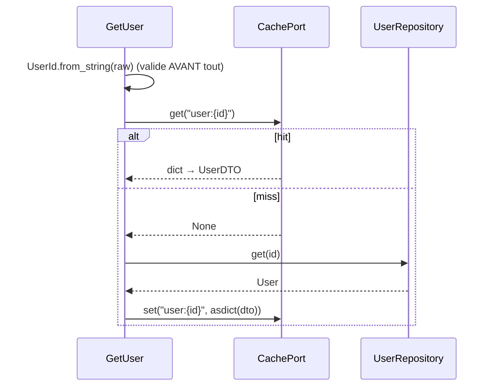

# 11. Cache & événements

> **TL;DR** — Le **cache** est une décision applicative, avec un contrat
> d'invalidation écrit, et jamais une source de vérité. Les **événements**
> découplent ce qui se passe *après* : un événement de domaine est émis par
> l'agrégat, un événement d'intégration par l'application — ce ne sont pas les
> mêmes.

Le [chapitre 09](09-lectures-et-query-services.md) a traité le chemin de lecture.
Restent deux préoccupations qui l'accompagnent : ne pas relire ce qu'on vient de
lire, et faire savoir aux autres que quelque chose s'est produit.

## Le cache : une décision applicative

Le cache est une optimisation de lecture. Il n'appartient ni au domaine (aucun
invariant n'en dépend) ni à l'infrastructure seule (c'est le use case qui décide
quoi cacher) — d'où le port dans `application/shared/cache.py`
([ch. 06](06-application-et-ports.md#les-ports--qui-déclare-le-besoin-)).

### Le patron cache-aside



Et le pendant obligatoire, côté mutation :

```python
# application/user/use_cases/rename_user.py
await self._cache.delete(f"user:{identity}")
```

### Les trois règles d'un cache qui ne devient pas un bug

1. **Le contrat d'invalidation est écrit** — ici dans le docstring de `GetUser` :
   la clé est `user:{id}`, toute mutation doit la supprimer. Un cache sans
   contrat documenté produit des données périmées que personne ne sait expliquer.
2. **Invalider plutôt que mettre à jour.** Supprimer la clé est idempotent et
   sans risque de course ; réécrire la valeur ne l'est pas.
3. **Le cache ne doit jamais être la source de vérité.** S'il est vide, froid ou
   en panne, l'application doit fonctionner — plus lentement, c'est tout.

### Cache ou query service ?

Les deux répondent au même symptôme (« c'est lent ») par deux moyens opposés, et
on les confond souvent :

| | Query service | Cache |
|---|---|---|
| Ce qu'il change | La **forme** de la requête | Le **nombre** de requêtes |
| Coût | Une classe à écrire | Une cohérence à gérer |
| Risque | Aucun (c'est du SQL) | Données périmées |
| Quand | La requête est mal formée | La requête est bonne mais trop fréquente |

L'ordre est important : **d'abord la bonne requête, ensuite le cache.** Mettre en
cache une requête N+1 ne fait que masquer le problème derrière un TTL — et le
premier cache froid le fait réapparaître, au pire moment.

Une conséquence de test, souvent découverte trop tard : un cache partagé rend une
suite non hermétique. C'est pourquoi les tests de ce projet démarrent un **Valkey
jetable** et le vident entre deux tests
([ch. 12](12-organisation-et-tests.md)).

## Les événements : ce qui se passe *après*

Une fois qu'une chose importante s'est produite, d'autres choses doivent souvent
suivre : notifier, mettre à jour un compteur, auditer. Les glisser dans le use
case le transforme peu à peu en fourre-tout couplé à tout le système.

### Événement de domaine vs événement d'intégration

Deux notions différentes, souvent confondues :

| | Événement de **domaine** | Événement d'**intégration** |
|---|---|---|
| Émis par | L'agrégat lui-même | La couche application |
| Vocabulaire | Interne au contexte | Contrat public, versionné |
| Portée | Dans le processus | Vers d'autres services / contextes |
| Exemple | `TaskCompleted` | message `task.shared` sur RabbitMQ |

Le patron pour un événement de domaine :

```python
# Illustratif, hors de ce dépôt
class Task:
    def complete(self) -> None:
        if self.status is TaskStatus.DONE:
            raise TaskAlreadyCompleted()
        self.status = TaskStatus.DONE
        self.completed_at = _now()
        self._events.append(TaskCompleted(task_id=self.id, owner_id=self.owner_id))
```

L'entité **enregistre** l'événement ; elle n'envoie rien elle-même. C'est ce qui
permet au domaine de dire « ceci s'est produit » sans jamais connaître les
e-mails, le broker, ni le moindre effet de bord.

#### Qui dispatche, et quand ?

On lit souvent « le use case collecte les événements après le commit et les
dispatche ». C'est impossible ici, et la raison est structurelle : la transaction
**entoure** le use case ([ch. 08](08-transactions-et-erreurs.md)).

```text
adaptateur primaire
└── transaction
    └── use case
        └── repositories
```

Le use case rend la main **avant** le commit. Il n'existe donc aucun « après le
commit » à l'intérieur. Le moment du dispatch est une propriété de la
**frontière**, pas du use case. Trois cas, à ne pas confondre :

1. **Handler interne, même transaction.** Le handler fait partie de l'opération :
   incrémenter un compteur, écrire une ligne d'audit. Le use case collecte
   `pull_events()` et dispatche lui-même, avant de rendre la main. Les écritures
   rejoignent la transaction et sont annulées avec elle — et leur échec fait
   échouer l'opération, ce qui est exactement le contrat voulu. D'où la règle :
   rien de non transactionnel dans ce cas.

2. **Notification interne, après commit.** Le handler ne doit tourner que si les
   données sont réellement persistées, mais son effet reste local et a le droit
   d'être « au mieux » : invalider une clé de cache, rafraîchir un index.

   ```text
   use case → collecte les événements → les confie à la frontière
   frontière → COMMIT → dispatch
   ```

   Le use case se contente de *collecter* ; c'est la **frontière** qui dispatche,
   parce qu'elle seule sait que le commit a réussi. Et cela suppose que la
   frontière soit un objet auprès duquel on peut s'enregistrer — un
   `UnitOfWorkPort` explicite, un collecteur à portée de requête. Une dépendance
   `yield` ne te le donne pas gratuitement. Ça reste « au mieux » : le processus
   peut mourir entre le commit et le dispatch.

3. **Effet qui sort du processus : l'outbox.** C'est la recommandation par défaut
   dès qu'on parle à RabbitMQ, à un fournisseur d'e-mail ou à un autre service.
   Le use case traduit l'événement de domaine en **événement d'intégration** et
   l'écrit comme une ligne d'outbox, dans la même session que les données métier ;
   un relais séparé le publie.

   ```text
   use case → ligne d'outbox (même session)
   ──────────────────── COMMIT ────────────────────
   relais → RabbitMQ
   ```

   Remarque ce dont ce cas n'a **pas** besoin : d'un crochet après commit. C'est
   précisément ce qui le rend robuste — la décision de publier est validée
   atomiquement avec les données, et la livraison devient un problème séparé et
   rejouable ([ch. 08](08-transactions-et-erreurs.md#loutbox--rendre-lintention-transactionnelle)).

Une règle relie les trois : **un événement de domaine ne part jamais tel quel sur
le réseau.** Le publier revient à exporter ton vocabulaire interne comme un
contrat public qu'il faudra ensuite versionner. La traduction domaine →
intégration est le travail du use case, et ce n'est pas une formalité.

### Ce que fait ce projet

Il n'a **pas** d'événements de domaine — le métier est trop simple pour les
justifier. Il a en revanche un vrai **événement d'intégration** :

```python
# application/shared/messaging.py — le contrat
@dataclass(frozen=True, slots=True)
class IntegrationEvent:
    name: ClassVar[str]            # le TYPE d'événement, pas une clé de routage

@dataclass(frozen=True, slots=True)
class ShareTaskNotification(IntegrationEvent):
    name: ClassVar[str] = "task.shared"
    task_id: str
    user_ids: list[str]
    subject: str
    body: str

# application/task/use_cases/share_task.py — l'émission
class ShareTask:
    async def execute(self, task_id: str, user_ids: list[str], subject: str, body: str) -> None:
        if not await self._task_repository.exists(TaskId.from_string(task_id)):
            raise TaskNotFound(f"La tâche {task_id} n'existe pas")
        event = ShareTaskNotification(task_id=task_id, user_ids=user_ids, ...)
        await self._message_adapter.publish(event)     # ni sérialisation, ni routage
```

La sérialisation et le routage n'apparaissent que dans l'adaptateur :

```python
# infrastructure/messaging/rabbitmq.py
body=orjson.dumps(asdict(event)),
routing_key=event.name,
```

`name` est un `ClassVar` : il n'entre pas dans les champs du dataclass, donc pas
dans le JSON publié. Le message sur le fil ne contient que les données — ce qui
permet au worker de faire `ShareTaskNotification(**payload)` sans rien savoir du
transport.

Le use case publie sur un port ; le worker consomme et exécute
`NotifyTaskShared`, qui envoie les e-mails. Résultat : **l'API répond sans
attendre le SMTP**, et une panne du serveur de mail ne fait pas échouer un
partage.

Note bien où se situe la publication : dans le **use case**, pas dans le
domaine. `Task` ignore qu'un partage puisse notifier qui que ce soit — et c'est
la raison pour laquelle le domaine reste testable en microsecondes.

> **La limite déjà signalée** ([ch. 08](08-transactions-et-erreurs.md#les-limites-à-connaître))
> : ce message part avant le commit. Si la transaction échoue ensuite, un e-mail
> aura été envoyé pour rien. Le pattern **outbox** — écrire le message en base
> dans la même transaction, le publier ensuite depuis un relais — est la réponse
> standard. Ne pas l'avoir est un compromis assumé à cette échelle.

### Alors, pourquoi un broker ?

La section précédente justifie l'**absence** d'outbox. Le risque, c'est d'en tirer
la conclusion symétrique et fausse : « si on tolère de perdre le message, autant
appeler le SMTP directement dans le use case et supprimer RabbitMQ ». Ce sont deux
questions distinctes :

- **« Le message doit-il être durable et transactionnel ? »** → c'est la question
  de l'outbox. Réponse ici : non.
- **« Ce travail doit-il sortir de la requête HTTP ? »** → c'est la question du
  broker. Réponse ici : oui.

Un broker n'est pas là pour garantir qu'un message ne se perd pas — mal configuré,
il en perd très bien. Il est là pour **découpler le rythme du producteur de celui
du consommateur**, et pour découpler l'émetteur de la liste de ceux qui écoutent.
Trois situations concrètes le rendent difficilement remplaçable.

**1. Lisser la charge.** Partager une tâche avec 10 000 utilisateurs, c'est 10 000
e-mails. Sans broker, la requête HTTP les envoie elle-même : elle tient une
connexion, un worker applicatif et une transaction pendant toute la durée de
l'opération, et ouvre autant de conversations SMTP que le fournisseur de mail
accepte d'en encaisser avant de limiter le débit — ou de blacklister le domaine.
Avec un broker, la file **est** le tampon : le producteur écrit un message et rend
la main ; le consommateur avance à son rythme. Le levier est du côté du
consommateur, pas de l'API :

```python
# presentation/worker/__main__.py
await channel.set_qos(prefetch_count=10)
```

Ce `prefetch_count` plafonne le nombre de messages non acquittés qu'un worker
accepte de garder en vol. C'est lui, et le nombre de workers, qui fixent le débit
réel — pas le trafic entrant. Un pic de partages allonge la file, il ne fait pas
tomber l'API.

**2. Rattraper les échecs sans écrire de moteur de retry.** Le serveur SMTP est
indisponible deux heures. Sans broker, il faut une table `email_retry`, un
compteur de tentatives, un `next_attempt_at`, un cron qui la balaie, et la
gestion des accès concurrents entre plusieurs instances. Avec un broker, la
redélivrance et la mise à l'écart deviennent de la **configuration de file**
([ch. 07](07-adaptateurs.md#le-worker-rabbitmq)) :

```python
queue = await channel.declare_queue(
    "email_notifications",
    durable=True,
    arguments={"x-dead-letter-exchange": "email_notifications.dlx"},
)
```

Une précision qui vaut d'être dite, parce qu'elle circule à l'envers : **RabbitMQ
ne fait pas de backoff exponentiel tout seul.** Un message rejeté sans `requeue`
part en dead-letter, point. Le délai croissant s'obtient par montage : une file
d'attente par palier (`x-message-ttl` de 1 min, 5 min, 15 min) qui dead-lette vers
l'exchange principal, ou le plugin `rabbitmq_delayed_message_exchange` pour tenir
la même chose en un seul exchange. Deux pièges au passage : le TTL par message
expire dans l'ordre de la file (un message à 15 min bloque derrière lui un message
à 1 min), et il faut un compteur de tentatives pour ne pas boucler indéfiniment —
sur une *quorum queue*, `x-delivery-limit` le fait pour toi. Ça reste bien moins
de code qu'une table de retry maison, mais ce n'est pas gratuit.

Dans ce projet la DLQ est volontairement un **terminus** : rien ne la consomme,
elle sert à ce qu'un échec soit visible plutôt que silencieux. Le rejeu est un
geste d'exploitation, pas une boucle automatique.

**3. Un événement, plusieurs consommateurs.** C'est le cas qui tranche vraiment.
Si `task.shared` doit, en plus de l'e-mail, alimenter un tableau de bord d'audit,
pousser un webhook Slack et synchroniser un CRM, la version sans broker demande
d'ouvrir le use case et d'y ajouter trois appels — donc de coupler `ShareTask` à
trois systèmes tiers, avec leurs pannes et leurs latences. Avec un broker, on ne
touche pas au producteur du tout : on déclare trois files de plus, chacune liée à
l'exchange sur la même clé de routage, chacune avec son rythme, ses échecs et son
propre déploiement.

Ce projet publie sur un exchange `DIRECT` avec une seule file liée à
`task.shared`. Passer à trois consommateurs, c'est trois `declare_queue` +
`bind` dans trois workers ; `ShareTask` et `RabbitMQMessageAdapter` restent
inchangés. **C'est ça, le découplage** : il ne se mesure pas au nombre de
composants, mais au nombre de fichiers qu'un nouveau besoin oblige à rouvrir.

### Et quand il n'est pas justifié

Le broker n'est pas neutre : c'est un composant avec état à déployer, superviser,
sécuriser et sauvegarder, plus un second processus (le worker) à faire vivre. Si
les trois conditions suivantes sont réunies, il n'apporte rien :

| Question | Si la réponse est… | Alors |
|---|---|---|
| Combien de consommateurs ? | **Un seul**, et il ne bougera pas | Le broker ne découple rien |
| Combien de temps prend le travail ? | Quelques **millisecondes** | Le faire dans la requête est plus simple |
| Y a-t-il des pics ? | Non, débit **régulier et faible** | Rien à lisser |

Dans ce cas, un `BackgroundTasks` FastAPI ou une tâche `asyncio` suffit — avec sa
propre limite, assumée : le travail meurt avec le processus, donc perte au premier
redémarrage. Et si le besoin est seulement de *rattraper des écarts*, la
réconciliation périodique évoquée au [chapitre 08](08-transactions-et-erreurs.md#en-a-t-on-vraiment-besoin-)
coûte encore moins cher.

Ici, RabbitMQ est justifié par le point 1 (l'envoi SMTP est lent et peut partir en
rafale) et par le point 3 en puissance (l'exchange est déjà en place, un second
consommateur ne coûte qu'un `bind`). Il l'est aussi, il faut le dire, parce que ce
dépôt sert de démonstration : il montre un adaptateur driving non-HTTP, ce qu'aucun
`BackgroundTasks` n'aurait illustré ([ch. 07](07-adaptateurs.md#le-worker-rabbitmq)).

## À retenir

- Le **cache** est une décision applicative : contrat d'invalidation écrit,
  suppression plutôt que mise à jour, jamais source de vérité.
- **D'abord la bonne requête, ensuite le cache** — un cache posé sur un N+1 ne
  fait que le masquer.
- **Événement de domaine** (émis par l'agrégat, interne) ≠ **événement
  d'intégration** (émis par l'application, contrat public).
- L'entité **enregistre** un événement, elle ne l'envoie pas.
- **Le use case n'a pas d'« après le commit »** : la transaction l'entoure. Trois
  cas distincts — handler dans la même transaction, notification confiée à la
  frontière, ou **outbox** pour tout ce qui sort du processus.
- Publier avant le commit est un compromis : le pattern **outbox** est la réponse
  quand ça devient inacceptable.
- Un **broker** ne sert pas à garantir la livraison, mais à **lisser la charge**,
  à externaliser les retries en configuration de file, et à laisser N consommateurs
  s'abonner sans toucher au producteur. Aucun de ces trois besoins ? Une tâche de
  fond suffit.

## À toi de jouer

1. `RenameUser` invalide `user:{id}`. Si on ajoutait un endpoint « liste des
   users » mis en cache sous `users:all`, quel bug apparaîtrait — et quelles sont
   les deux stratégies pour le corriger ?
2. Une page est lente parce qu'elle déclenche 51 requêtes. Un collègue propose de
   mettre le résultat en cache 5 minutes. Pourquoi est-ce le mauvais premier
   geste, et que fais-tu avant ?
3. Le worker échoue à envoyer un e-mail sur 3 destinataires. Où va l'information
   d'échec, et pourquoi le message principal est-il quand même acquitté ?
4. On te demande d'envoyer un e-mail de bienvenue à la création d'un utilisateur :
   un seul destinataire, un seul consommateur, aucun pic attendu. Faut-il passer
   par RabbitMQ ? Justifie avec les trois questions de la section « Et quand il
   n'est pas justifié », et nomme ce que tu perds dans l'option la plus simple.

→ [Corrigés](14-annexes.md#c-corrigés-des-exercices)
