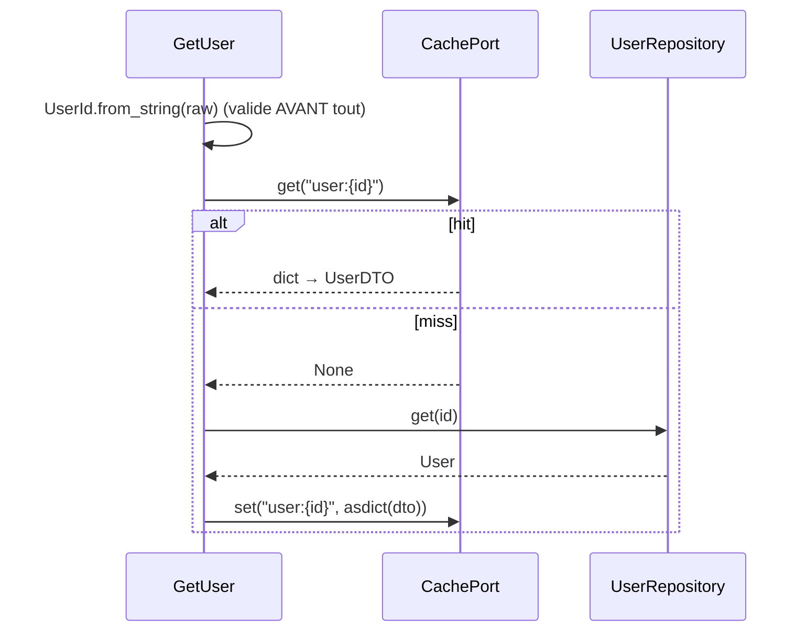

# 11. Cache & événements

> **TL;DR** — Le **cache** est une décision applicative, avec un contrat
> d'invalidation écrit, et jamais une source de vérité. Les **événements**
> découplent ce qui se passe *après* : un événement de domaine est émis par
> l'agrégat, un événement d'intégration par l'application — ce ne sont pas les
> mêmes.

Le [chapitre 09](09-lectures-et-query-services.md) a traité le chemin de lecture.
Restent deux préoccupations qui l'accompagnent : ne pas relire ce qu'on vient de
lire, et faire savoir aux autres que quelque chose s'est produit.

## Le cache : une décision applicative

Le cache est une optimisation de lecture. Il n'appartient ni au domaine (aucun
invariant n'en dépend) ni à l'infrastructure seule (c'est le use case qui décide
quoi cacher) — d'où le port dans `application/shared/cache.py`
([ch. 06](06-application-et-ports.md#les-ports--qui-déclare-le-besoin-)).

### Le patron cache-aside



Et le pendant obligatoire, côté mutation :

```python
# application/user/use_cases/rename_user.py
await self._cache.delete(f"user:{identity}")
```

### Les trois règles d'un cache qui ne devient pas un bug

1. **Le contrat d'invalidation est écrit** — ici dans le docstring de `GetUser` :
   la clé est `user:{id}`, toute mutation doit la supprimer. Un cache sans
   contrat documenté produit des données périmées que personne ne sait expliquer.
2. **Invalider plutôt que mettre à jour.** Supprimer la clé est idempotent et
   sans risque de course ; réécrire la valeur ne l'est pas.
3. **Le cache ne doit jamais être la source de vérité.** S'il est vide, froid ou
   en panne, l'application doit fonctionner — plus lentement, c'est tout.

### Cache ou query service ?

Les deux répondent au même symptôme (« c'est lent ») par deux moyens opposés, et
on les confond souvent :

| | Query service | Cache |
|---|---|---|
| Ce qu'il change | La **forme** de la requête | Le **nombre** de requêtes |
| Coût | Une classe à écrire | Une cohérence à gérer |
| Risque | Aucun (c'est du SQL) | Données périmées |
| Quand | La requête est mal formée | La requête est bonne mais trop fréquente |

L'ordre est important : **d'abord la bonne requête, ensuite le cache.** Mettre en
cache une requête N+1 ne fait que masquer le problème derrière un TTL — et le
premier cache froid le fait réapparaître, au pire moment.

Une conséquence de test, souvent découverte trop tard : un cache partagé rend une
suite non hermétique. C'est pourquoi les tests de ce projet démarrent un **Valkey
jetable** et le vident entre deux tests
([ch. 12](12-organisation-et-tests.md)).

## Les événements : ce qui se passe *après*

Une fois qu'une chose importante s'est produite, d'autres choses doivent souvent
suivre : notifier, mettre à jour un compteur, auditer. Les glisser dans le use
case le transforme peu à peu en fourre-tout couplé à tout le système.

### Événement de domaine vs événement d'intégration

Deux notions différentes, souvent confondues :

| | Événement de **domaine** | Événement d'**intégration** |
|---|---|---|
| Émis par | L'agrégat lui-même | La couche application |
| Vocabulaire | Interne au contexte | Contrat public, versionné |
| Portée | Dans le processus | Vers d'autres services / contextes |
| Exemple | `TaskCompleted` | message `task.shared` sur RabbitMQ |

Le patron pour un événement de domaine :

```python
# Illustratif, hors de ce dépôt
class Task:
    def complete(self) -> None:
        if self.status is TaskStatus.DONE:
            raise TaskAlreadyCompleted()
        self.status = TaskStatus.DONE
        self.completed_at = _now()
        self._events.append(TaskCompleted(task_id=self.id, owner_id=self.owner_id))
```

L'entité **enregistre** l'événement ; elle n'envoie rien elle-même. Le use case
collecte `task.pull_events()` après le commit et les dispatche. C'est ce qui
permet au domaine de dire « ceci s'est produit » sans jamais connaître les
e-mails, le broker, ni le moindre effet de bord.

### Ce que fait ce projet

Il n'a **pas** d'événements de domaine — le métier est trop simple pour les
justifier. Il a en revanche un vrai **événement d'intégration** :

```python
# application/shared/messaging.py — le contrat
@dataclass(frozen=True, slots=True)
class IntegrationEvent:
    name: ClassVar[str]            # le TYPE d'événement, pas une clé de routage

@dataclass(frozen=True, slots=True)
class ShareTaskNotification(IntegrationEvent):
    name: ClassVar[str] = "task.shared"
    task_id: str
    user_ids: list[str]
    subject: str
    body: str

# application/task/use_cases/share_task.py — l'émission
class ShareTask:
    async def execute(self, task_id: str, user_ids: list[str], subject: str, body: str) -> None:
        if not await self._task_repository.exists(TaskId.from_string(task_id)):
            raise TaskNotFound(f"La tâche {task_id} n'existe pas")
        event = ShareTaskNotification(task_id=task_id, user_ids=user_ids, ...)
        await self._message_adapter.publish(event)     # ni sérialisation, ni routage
```

La sérialisation et le routage n'apparaissent que dans l'adaptateur :

```python
# infrastructure/messaging/rabbitmq.py
body=orjson.dumps(asdict(event)),
routing_key=event.name,
```

`name` est un `ClassVar` : il n'entre pas dans les champs du dataclass, donc pas
dans le JSON publié. Le message sur le fil ne contient que les données — ce qui
permet au worker de faire `ShareTaskNotification(**payload)` sans rien savoir du
transport.

Le use case publie sur un port ; le worker consomme et exécute
`NotifyTaskShared`, qui envoie les e-mails. Résultat : **l'API répond sans
attendre le SMTP**, et une panne du serveur de mail ne fait pas échouer un
partage.

Note bien où se situe la publication : dans le **use case**, pas dans le
domaine. `Task` ignore qu'un partage puisse notifier qui que ce soit — et c'est
la raison pour laquelle le domaine reste testable en microsecondes.

> **La limite déjà signalée** ([ch. 08](08-transactions-et-erreurs.md#les-limites-à-connaître))
> : ce message part avant le commit. Si la transaction échoue ensuite, un e-mail
> aura été envoyé pour rien. Le pattern **outbox** — écrire le message en base
> dans la même transaction, le publier ensuite depuis un relais — est la réponse
> standard. Ne pas l'avoir est un compromis assumé à cette échelle.

## À retenir

- Le **cache** est une décision applicative : contrat d'invalidation écrit,
  suppression plutôt que mise à jour, jamais source de vérité.
- **D'abord la bonne requête, ensuite le cache** — un cache posé sur un N+1 ne
  fait que le masquer.
- **Événement de domaine** (émis par l'agrégat, interne) ≠ **événement
  d'intégration** (émis par l'application, contrat public).
- L'entité **enregistre** un événement, elle ne l'envoie pas.
- Publier avant le commit est un compromis : le pattern **outbox** est la réponse
  quand ça devient inacceptable.

## À toi de jouer

1. `RenameUser` invalide `user:{id}`. Si on ajoutait un endpoint « liste des
   users » mis en cache sous `users:all`, quel bug apparaîtrait — et quelles sont
   les deux stratégies pour le corriger ?
2. Une page est lente parce qu'elle déclenche 51 requêtes. Un collègue propose de
   mettre le résultat en cache 5 minutes. Pourquoi est-ce le mauvais premier
   geste, et que fais-tu avant ?
3. Le worker échoue à envoyer un e-mail sur 3 destinataires. Où va l'information
   d'échec, et pourquoi le message principal est-il quand même acquitté ?

→ [Corrigés](14-annexes.md#c-corrigés-des-exercices)
