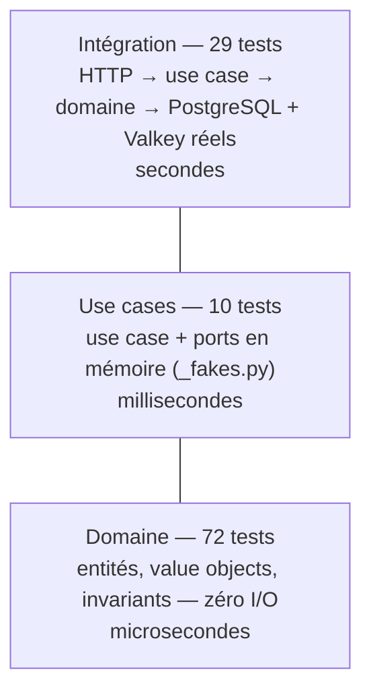

# 12. Organisation & tests

> **TL;DR** — Couche et bounded context sont deux dimensions **orthogonales** :
> ce projet tranche verticalement à chaque couche. Trois niveaux de tests, pas
> deux : domaine pur, use cases avec doublures, intégration sur les moteurs
> réels (testcontainers).

## Deux dimensions, pas une

Beaucoup de discussions « par couche ou par feature ? » sont mal posées : ce ne
sont pas deux options concurrentes, ce sont deux **axes** d'un même plan.

|  | `task` | `user` | transverse |
|---|---|---|---|
| **presentation** | `v1/routers/tasks.py` | `v1/routers/users.py` | `app.py`, `error_handlers.py`, `dependencies/session.py` |
| **infrastructure** | `persistence/task/` | `persistence/user/` | `persistence/database.py`, `config.py`, `cache/`, `mail/` |
| **application** | `application/task/` | `application/user/` | `application/shared/` (ports techniques, erreurs) |
| **domain** | `domain/task/` | `domain/user/` | `domain/shared/` (bases d'exceptions) |

Les **couches** répondent à « quel type de responsabilité ? ». Les **contextes**
répondent à « quel morceau de métier ? ». La question réelle est : *dans quel
sens découpe-t-on les dossiers en premier ?*

Ce projet découpe **par couche d'abord, par contexte ensuite**. Pourquoi ce sens :
la règle de dépendance est vérifiée entre couches (import-linter), donc les
couches doivent être des frontières physiques évidentes. À l'échelle supérieure —
si `task` et `user` devenaient deux services — on inverserait probablement.

## Le découpage vertical, concrètement

```
domain/task/          domain/user/
application/task/     application/user/
persistence/task/     persistence/user/
v1/schemas/task.py    v1/schemas/user.py
v1/routers/tasks.py   v1/routers/users.py
dependencies/task.py  dependencies/user.py
```

Le bénéfice : on travaille **par fonctionnalité**. Ajouter un contexte = ajouter
des dossiers, sans toucher aux fichiers existants. On lit un contexte de bout en
bout sans naviguer dans dix fichiers fourre-tout.

Le coût, à connaître : un peu de duplication structurelle entre contextes (chaque
contexte a son mapper, son repository, ses schémas) et la tentation de partager
trop vite. La bonne réponse à « ces deux contextes se ressemblent » est le plus
souvent **rien du tout** : deux contextes qui évoluent séparément ont le droit de
se ressembler aujourd'hui et de diverger demain. Le vrai transverse
(`domain/shared/`, `application/shared/`, `persistence/database.py`) est ce qui
n'appartient à **aucun** métier.

### La bonne dose de centralisation

Nuance apprise dans ce projet : **on ne découpe pas tout mécaniquement**.

- La composition root (`dependencies/`) garde un `__init__.py` **façade** qui
  réexpose tout, parce que son intérêt *est* d'être un point d'entrée unique.
- Les schémas (`v1/schemas/`) sont simplement découpés, **sans façade** : ce sont
  des contrats par contexte, sans rôle centralisateur.

Le découpage sert la lisibilité ; ce n'est pas un dogme à appliquer partout. Une
façade ajoutée « pour la symétrie » est du couplage gratuit.

#### Le compromis de la façade

C'est un choix, pas une recommandation générale — et il a un coût qu'il faut
nommer plutôt que passer sous silence.

| | Avec façade (ce projet) | Sans façade |
|---|---|---|
| Import dans un router | une ligne, une seule origine | un import par module de dépendances |
| Ajouter un use case | un provider **et** une entrée dans `__all__` | un provider, c'est tout |
| Travail à plusieurs | tout le monde édite le même fichier → conflits Git | chacun touche son contexte |
| Coût à l'import | charger la façade charge *tous* les providers | on ne charge que ce qu'on utilise |

Deux précisions, parce que la critique habituelle de ce motif vise souvent à côté :

- **La façade ne couple pas les contextes entre eux.** `dependencies/task.py`
  n'importe pas `dependencies/user.py` : c'est l'agrégateur qui dépend des
  parties, jamais l'inverse. Le sens de la dépendance est ce qui distingue une
  façade d'un couplage.
- **La verbosité du `__all__` n'est pas de la cérémonie.** En mypy strict,
  `no_implicit_reexport` est actif : sans liste explicite, les noms importés dans
  un `__init__.py` ne sont pas réexportés. Le boilerplate vient du vérificateur de
  types, pas du motif.

Le seuil de bascule est simple à énoncer : **la façade paie tant qu'une seule
personne touche ce fichier.** À plusieurs, ou passé quelques dizaines de
providers, la maintenance de `__all__` coûte plus qu'elle ne rapporte — et des
`dependencies/` par contexte, importés directement par chaque router, deviennent
le meilleur choix.

| Concept | Ce que dit le principe | Ce que fait ce projet |
|---------|------------------------|-----------------------|
| Composition root | La décision d'association port ↔ adaptateur reste en un point unique | Façade `__init__.py` : un import, au prix d'un fichier partagé |

## Les trois niveaux de tests

La version précédente de ce cours n'en décrivait que deux. Il y en a bien trois,
et le niveau intermédiaire est celui qu'on oublie le plus souvent.



### 1. Le domaine : pur et instantané

Aucune base, aucun HTTP, aucun mock. Juste des objets.

```python
# tests/unit/domain/test_task_entity.py
def test_complete_twice_is_rejected() -> None:
    task = Task.create(owner_id=UserId.generate(), title=TaskTitle("x"))
    task.complete()
    with pytest.raises(TaskAlreadyCompleted):
        task.complete()
```

C'est *possible et facile* précisément parce que le domaine ne dépend d'aucun
framework ([ch. 01](01-regle-de-dependance.md)). **Si tes règles métier sont
dures à tester, c'est le signe qu'elles sont mélangées à de la technique** — le
juge de paix le plus fiable de toute cette architecture.

### 2. Les use cases : ports doublés en mémoire

Le niveau intermédiaire teste l'**orchestration** : les branches, les cas
d'erreur, les interactions entre ports — sans I/O.

```python
# tests/unit/application/_fakes.py
class FakeTaskRepository(TaskRepository):
    def __init__(self, tasks: list[Task] | None = None) -> None:
        self._by_id: dict[TaskId, Task] = {t.id: t for t in (tasks or [])}
        self.saved: list[Task] = []

    async def save(self, task: Task) -> None:
        self._by_id[task.id] = task
        self.saved.append(task)          # on enregistre pour pouvoir l'asserter

    async def get(self, task_id: TaskId) -> Task:
        try:
            return self._by_id[task_id]
        except KeyError:
            raise TaskNotFound(str(task_id)) from None
```

```python
# tests/unit/application/test_create_task.py (esprit)
async def test_create_task_rejects_unknown_owner() -> None:
    use_case = CreateTask(FakeTaskRepository(), FakeUserRepository())
    with pytest.raises(UserNotFound):
        await use_case.execute(CreateTaskCommand(owner_id=str(UserId.generate()), title="x"))
```

Ce niveau est le grand bénéficiaire de l'architecture : il n'existe que parce que
les use cases ne dépendent que de **ports**. Les doublures du projet couvrent
aussi `FakeCache`, `RecordingPublisher` et `FakeSMTP` — ce qui permet de tester
un hit de cache, une publication de message ou un échec d'envoi partiel **sans
Valkey, sans RabbitMQ, sans serveur mail**.

Préfère ces **doublures écrites à la main** aux mocks génériques : une `FakeTaskRepository`
qui implémente réellement le port échoue à la compilation (mypy) si le port
change, là où un `Mock()` continue de passer en mentant.

### 3. L'intégration : les moteurs réels

Les tests d'intégration exercent toute la chaîne — HTTP → use case → domaine →
base — via un client HTTP asynchrone, sur un **PostgreSQL et un Valkey jetables**
démarrés par [testcontainers] (`tests/integration/conftest.py`).

[testcontainers]: https://testcontainers-python.readthedocs.io/

```python
# tests/integration/conftest.py (extrait)
@pytest.fixture(scope="session")
def database_url() -> Iterator[str]:
    with PostgresContainer("postgres:17-alpine", driver="asyncpg") as postgres:
        yield postgres.get_connection_url()

@pytest.fixture(scope="session")
def redis_url() -> Iterator[str]:
    with RedisContainer("valkey/valkey:8-alpine") as valkey:
        ...
```

**Pourquoi les moteurs réels et pas un substitut in-memory ?** Parce qu'un test
qui passe sur un dialecte que la production n'utilise pas ne prouve pas
grand-chose. Ici on exerce vraiment le type `uuid` natif, `timestamptz`, les
violations d'unicité, le `ON DELETE CASCADE`, et le protocole Redis. Le prix :
quelques secondes au démarrage de la suite, et **un démon Docker obligatoire**.

Les conteneurs rendent aussi la suite **hermétique**. Sans eux, un Redis qui
écoute sur le port par défaut de la machine — la stack `docker compose` du
projet, typiquement — serait utilisé par les tests, qui liraient alors des
entrées laissées par un run précédent.

**Ce que la fixture `client` remplace, exactement.** Elle monte la **vraie**
application (routers, DI, handlers d'erreurs authentiques) et surcharge deux
choses seulement :

- `get_session` → une dépendance équivalente (mêmes `commit`/`rollback`) pointant
  sur la **même base de test** que les fixtures de seed. Ce n'est **pas** une base
  in-memory : c'est le PostgreSQL du conteneur ;
- l'adaptateur de messagerie → un publisher inerte, pour ne pas exiger un
  RabbitMQ réel.

Le reste du câblage est celui de la production. C'est la composition root
([ch. 08](08-transactions-et-erreurs.md#4-la-composition-root)) qui rend cette
substitution chirurgicale.

Deux autres choix de la conftest valent d'être notés :

- **Schéma créé et détruit à chaque test** (`create_all` / `drop_all`) :
  isolation totale, aucune dépendance à l'ordre d'exécution.
- **Les données de départ sont semées via les use cases**, jamais en SQL brut. Un
  seed SQL peut créer un état que le code métier n'aurait jamais produit — et donc
  tester une situation impossible.

```python
# tests/integration/api/test_users_api.py
async def test_list_user_tasks_returns_only_owned_tasks(client):
    alice = await _create_user(client, email="alice@example.com")
    await client.post(f"/api/v1/users/{alice}/tasks", json={"title": "T1"})
    tasks = await client.get(f"/api/v1/users/{alice}/tasks")
    assert all(t["owner_id"] == alice for t in tasks.json())
```

### La règle de répartition

| Ce que tu testes | Niveau |
|---|---|
| Un invariant, une validation, une transition d'état | Domaine |
| Une orchestration, une branche d'erreur, un hit/miss de cache | Use case (fakes) |
| Un parcours complet, un code HTTP, une contrainte SQL, un comportement du moteur | Intégration |

Le principe : **on ne teste pas deux fois la même chose**. Vérifier « titre vide
refusé » dans un test d'intégration, alors qu'un test de domaine le couvre déjà,
ajoute des secondes de suite pour zéro information.

La répartition réelle de ce projet — 72 / 10 / 29 — n'est pas un objectif à
copier. C'est ce que produit le principe ci-dessus appliqué à ce métier-là. Un
domaine plus riche ferait grossir la base ; un domaine anémique la ferait
disparaître, ce qui serait le vrai signal d'alarme.

## Les garde-fous automatisés

```bash
make lint     # ruff + import-linter + mypy strict
make test     # les trois niveaux
make check    # = lint + test, reproduit la CI en local
```

`make imports` (import-linter) est le test d'architecture du
[chapitre 01](01-regle-de-dependance.md#comment-on-la-vérifie-ici) : il tourne en
pre-commit et en CI. Une règle d'architecture non vérifiée se dégrade en quelques
mois — celle-ci ne peut pas.

## À retenir

- Couche et bounded context sont **orthogonaux** ; ce projet découpe par couche
  d'abord, par contexte ensuite, pour que les couches restent des frontières
  vérifiables.
- Le découpage sert la lisibilité, pas la symétrie (façade pour la composition
  root, pas pour les schémas).
- **Trois** niveaux de tests : domaine pur, use cases avec doublures maison,
  intégration sur les moteurs réels.
- Les tests d'intégration visent **PostgreSQL et Valkey réels** ; seule la
  dépendance de session et le publisher sont substitués.
- Un domaine difficile à tester est un domaine mal isolé : c'est le juge de paix.

## À toi de jouer

1. Tu ajoutes la règle « un titre ne peut pas contenir d'URL ». À quel niveau
   écris-tu le test, et combien de tests au total ?
2. La fixture `client` surcharge `get_session` par une dépendance qui commit et
   rollback à l'identique. Que testerait-on en moins si elle committait
   systématiquement, sans `try/except` ?
3. Pourquoi les fixtures de seed passent-elles par `CreateUser` plutôt que par un
   `INSERT` SQL ? Donne un bug qu'un seed SQL pourrait masquer.

→ [Corrigés](14-annexes.md#c-corrigés-des-exercices)
